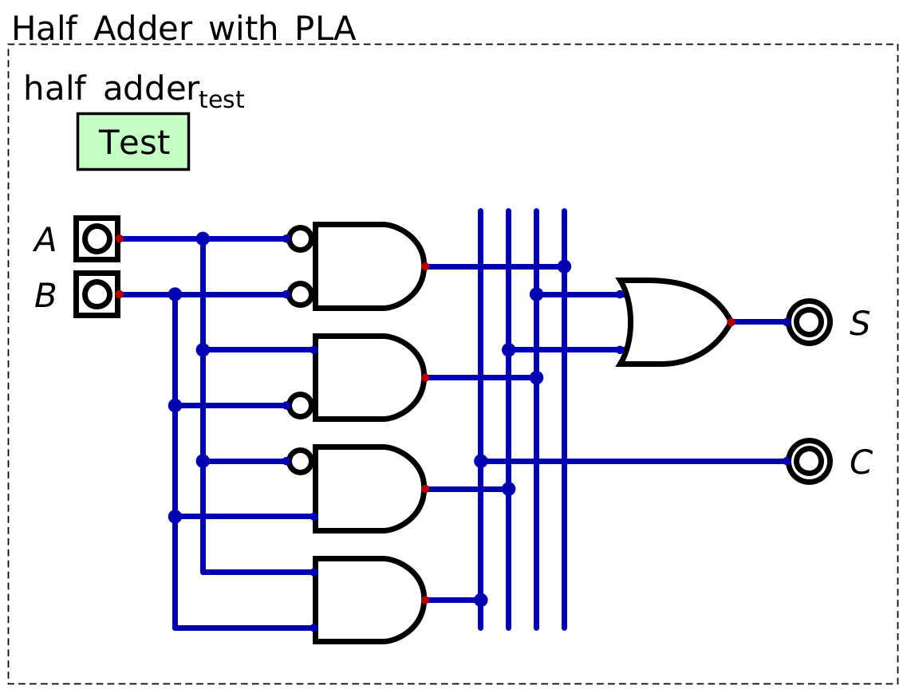

*****************
Half & Full Adder
*****************

* Memory was created using flip-flops, which are a form of sequential logic
* Earlier, combinational logic was used to perform logical operations
* Now, combinational logic will be used to perform addition

    * However, it will become clear soon that binary addition is effectively a logical operation

Binary Addition as a Logical Operation
======================================

* If one wants to add two bits together, how many output bits are needed?
* To answer this, consider the possibilities

    * :math:`0_{2} + 0_{2} = 0_{2}`
    * :math:`0_{2} + 1_{2} = 1_{2}`
    * :math:`1_{2} + 0_{2} = 1_{2}`
    * :math:`1_{2} + 1_{2} = 10_{2}`

* As one can see, when adding two ``1``\s together, a carry bit is needed
* Thus, when adding two bits together, two output bits are required

* In general, when adding two :math:`n` bit numbers together, :math:`n+1` bits is sufficient to output the correct sum

    * Remember, adding a bit doubles the number of representable values

* Consider the below table showing the result of adding two one bit numbers together

    * :math:`A` and :math:`B` are the two one bit numbers
    * :math:`S` is the sum bit
    * :math:`C` is the carry bit

.. list-table:: Two Bit Addition as a Logical Operation
    :widths: auto
    :align: center
    :header-rows: 1

    * - :math:`A`
      - :math:`B`
      -
      - :math:`C`
      - :math:`S`
    * - ``0``
      - ``0``
      -
      - ``0``
      - ``0``
    * - ``0``
      - ``1``
      -
      - ``0``
      - ``1``
    * - ``1``
      - ``0``
      -
      - ``0``
      - ``1``
    * - ``1``
      - ``1``
      -
      - ``1``
      - ``0``

* Referring to the above table, notice how this is effectively a logical operation

    * When both inputs are ``0``, output ``00``
    * When one input is ``1``, output ``01``
    * When both inputs are ``1``, output ``10``

* As previously discussed, programmable logic arrays can be configured to create any boolean logical function

    A PLA designed to perform the function of adding two one bit numbers together.

* A circuit capable of adding two one bit numbers together is called a *half adder*

Half Adder
==========

Full Adder
==========

* The general idea is the same, but we need to allow for carry bits to be inputted to be accounted for in the sum
* show table

Again, look at each output independetly
S is 1 only when 1 or 3 bits are 1 (odd number of 1s)
    * this is XOR still
    * remember that XOR is an even/odd checker

C is 1 when any combination of two or more input bits are 1

    * A + B
    * A + C
    * B + C
    * A + B + C

* C can be simplified by checking if A + B, or if (A + B) + C

SHOW IMAGE

This is called a full adder
Now, just chain them

Adding Larger Numbers
=====================

Symbol
======

For Next Time
=============

* Read Chapter 2 Section 3 of your text

    * 2 pages