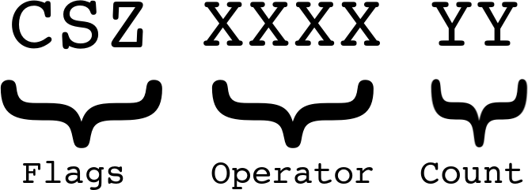
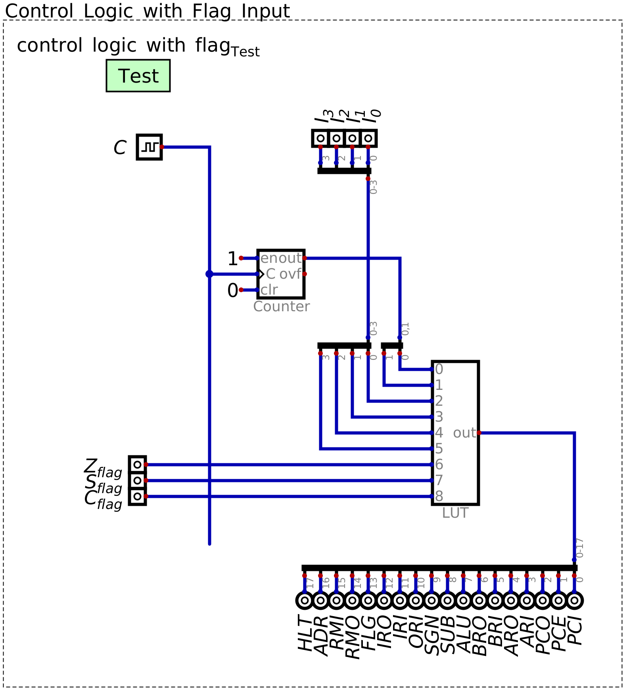
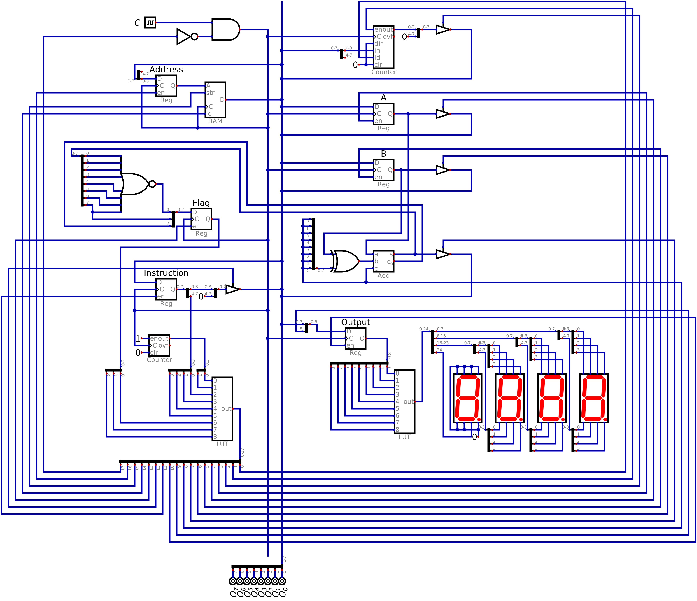

=============================
Conditional Jump Instructions
=============================

* The various status flag values can now be determined and stored in the flags register
* However, how should the conditional jumps be handled by the control logic?
* Further, the existing control logic needs to be updated to now handle the new flag register control signal

    * When should the system's status signal values be stored stored in the flags register?

Conditional Jump Control Logic
==============================

* The conditional jumps allow the program to jump to different parts of the program based on some condition
* More specifically, when some status flag is high, the conditional jump updates the program counter's value

    * The program counter is updated to contain a new memory address --- the address of the new next instruction
    * In the same way as the jump always instruction

* For example, consider a jump zero command --- ``JMPZ``

    * If the zero status flag is high, update the program counter with some specified memory address
    * If the status flag is low, ignore and carry on

* Notice that this instruction has two cases

    * Two versions of the instruction that can be performed

* The control logic for the two versions of the instruction effectively already exists

    * The jump version control logic is the same as the ``JMPA`` instruction

        * Fetch cycle
        * Move operand (memory address to jump to) out from the instruction register into the program counter

    * The ignore version is a ``NOOP``

        * Fetch cycle
        * Nothing

* What does not exist is a way to select which version of the instruction to perform

    * The jump, or the ``NOOP`` version

Controlling the Cases
---------------------

* If the status flags store their respective conditions, they indicate which version of the conditional jumps to perform

    * For example, if the :math:`Z_{flag}` signal is high, perform the jump version, if it's low, perform ``NOOP``

* The same idea used for dealing with the output register's unsigned/signed cases can be used

    * Multiple look up tables with a multiplexer *could* be used
    * Or, a single, larger, look up table with additional input signals can be used

* With this idea, the status flags can be input into the control logic's look up table

    * This results in a total of 9 inputs

    The 9 bit input to the look up table broken down into the three parts --- flags, operator, and microcode counter.
    The most significant 3 bits, ``CSZ`` correspond to the status flags (carry, significant/sign, zero), the next 4 bits
    specify an instruction's operator ``XXXX``, and the final 2 bits ``YY`` are the microcode step, from the microcode
    counter.

* Like before, different segments of the input to the look up table have different meaning

    * The lest significant 2 bits correspond to the microcode counter
    * The next 4 bits correspond to the specific instruction
    * The additional 3 bits, the most significant bits, correspond to the status flags

    Design of the look up table with the status flag signals included as inputs. This design has a total of 9 signals
    serving as inputs to the look up table --- 3 for the status signals, 4 for the instruction's operator, and 2 for
    the microcode step. Notice the ``FLG`` control signal on the output from the look up table --- this controls when
    the flags register is enabled.

* Since there are an additional 3 input bits, the size of the look up table grows by eight times

    * Eight segments of 16 instructions

* Each of the eight segments of the look up table corresponds to how the instructions should work given the status flags
* However, of the 16 instructions, only the 3 conditional jumps will be different, depending on the status flags

    * With this design, it means that there will be a lot of redundant, duplicate control logic
    * But it will make the implementation simple

* With this design in mind, there still needs to be control over when the flags register is enabled

Enabling Flag Register
======================

Enabling Flag Register
======================

* As discussed, the status flag register needs to be enabled at specific times to work

    * Only enable when performing addition or subtraction
    * Disabled at all other times

* However, both addition and subtraction take several clock cycles

    * Every instruction is allocated 4 clock cycles
    * Although, addition (``ADAB``) and subtraction (``SUAB``) only require 3

        * Fetch (2 clock cycles)
        * Output from ALU to the A register, and set the subtract signal where necessary (1 clock cycle)

* Therefore, the question is, when *exactly* should the flag enable signal be set high?

* It does not make sense to do it during the two clock cycles of fetch

    * All fetch cycles should be the same
    * Has nothing to do with the underlying instruction

* It could work during the ALU -> A register step

    * At this instant, the value the ALU has is the value to be calculated
    * Therefore, the status flags at this time are relevant to the instruction

* It would not work *after* the ALU -> A step

    * The value in the A register would be change after the ALU -> A step
    * This means the status flags may have changed
    * For example, performing ``5 - 5``

        * If A is ``5`` and B is ``5`` before subtraction, the ALU calculates ``0``, and the ``Z`` flag is high
        * After the ALU -> A step, A now stores ``0``, meaning the ALU calculates ``0 - 5``, and ``Z`` is now low

* Therefore, the flag register enable should be high at the time that the ALU is being output

.. note::

    One may wonder --- is it possible for the value from the ALU to be latched into A, thereby altering the status
    signals, before the value of the status signals can be latched into the flags register?

    This is not an unreasonable question to ask, and can be addressed by making the addition and subtraction
    instructions take four clock cycles by adding a new microinstruction after the fetch cycle, but before the ALU -> A
    step:

        * Fetch (2 cycles)
        * Set subtract if necessary and store the status signals (1 cycle)
        * Set subtract if necessary and ALU -> A (1 cycle)

    However, this is not a real concern given the synchronization of the system. Within Digital, values are latched into
    the registers the instant the clock signal goes high. In practice, there would be some delay due to the physical
    limitations of the hardware, but any delay on latching a value into the flags register would be less than the total
    delay of latching a value into the A register, outputting from the A register, moving to the ALU, and moving through
    the ALU.

Including the Flag Register in the System
=========================================

* Physically including the status logic and the flags register is a matter of connecting it to the existing system

* Connect the output of the ALU to the input of the condition status logic
* Replace the old control logic look up table design with the new one

    * The 3 output from the flags register are connected to the inputs to the look up table
    * The 1 new output from the look up table connects to the status flag register's enable

* Notice the cycle --- the flags register controls the control logic, which controls the flags register

    Configuration of the ESAP system with the status condition logic and the flags register included. The ESAP system is
    now computationally complete.

Updating the Look Up Table Contents
-----------------------------------

* The contents of the look up table needs to be updated to account for the changes

    * Three new commands for the three different conditional jumps
    * Three new status signals serving as inputs to the look up table
    * An additional output signal from the look up table

* A modified version of the script used before to generate the hex file for the look up table is used

* Like before, below are constants specifying the position of the control signal's bit

    * Here, there are a total of 18 bits, which is one more than before
    * This corresponds to the control signal for the status flag register enable

.. literalinclude:: create_control_logic_with_flag_patterns_for_look_up_table.py
    :language: python
    :lineno-match:
    :emphasize-lines: 5
    :start-after: # [begin-control_signal_pattern_constants]
    :end-before: # [end-control_signal_pattern_constants]

* Since the jump instructions are special, their operator bit patterns will be made constants

.. literalinclude:: create_control_logic_with_flag_patterns_for_look_up_table.py
    :language: python
    :lineno-match:
    :start-after: # [begin-conditional_jump_opcodes]
    :end-before: # [end-conditional_jump_opcodes]

* Similar to before, the microcode instructions are stored in a list
* The specific microcodes for each instruction are created with bitwise OR on the control signal constants

* The difference here versus before is

    * The inclusion of the ``FLG`` signal on the addition and subtraction instructions
    * The labelling of ``JMPZ``, ``JMPS``, and ``JMPC`` instructions

        * Notice that they are still effectively ``NOOP`` instructions here
        * This will be their *default* behaviors
        * Only under the special conditions do they act like jump instructions

.. literalinclude:: create_control_logic_with_flag_patterns_for_look_up_table.py
    :language: python
    :lineno-match:
    :emphasize-lines: 9-10, 12-14
    :start-after: # [begin-instruction_microcodes]
    :end-before: # [end-instruction_microcodes]

* The above 16 instructions are how the instructions should work when none of the status flags are high
* However, the conditional jumps need to work differently depending on the status flag signals

* As discussed, each row/individual microcode is accessed by some input patter in the look up table
* With this new design, the 3 most significant bits correspond to the status flag signals

    * ``CSZ|XXXX|YY``
    * ``Flags|Instruction|Step``

* The above list of 16 instructions and microcodes correspond to the first set of 16, when no status signals are high

    * ``000|XXXX|YY``

* The pattern of 16 instructions and microcodes will be repeated 8 times

    * Once for each combination of the status signals being high
    * ``000`` --- No flags
    * ``001`` --- Zero flag set
    * ``010`` --- Significant/sign flag set
    * ``011`` --- Significant/sign and zero flags set
    * ``100`` --- Carry flag set
    * ``101`` --- Carry and zero flags set
    * ``101`` --- Carry and significant/sign flags set
    * ``111`` --- Carry, significant/sign, and zero flags set

* For each of the 8 groupings, the conditional jumps will act as a jump when the respective status signal is high

    * Otherwise, it acts as a ``NOOP``

.. literalinclude:: create_control_logic_with_flag_patterns_for_look_up_table.py
    :language: python
    :lineno-match:
    :emphasize-lines: 5-7
    :start-after: # [begin-save_to_file]
    :end-before: # [end-save_to_file]

* This checks if the current instruction is a conditional jump and if the corresponding status flag is high

    * When this is the case, act as a jump instruction
    * Otherwise, use the default behaviour

* This script would generate the new contents for the control logic's look up table

    * This hex file is to be loaded into the system's new look up table

* With this updated control logic, the system now has the ability to branch on conditions

Programming with Conditional Jumps
==================================

* With this new functionality, conditional jumps, branching can now be achieved

* Consider the problem discussed before

    * Given some number, output ``1`` if it is less than ``10``, otherwise, output ``0``

* This problem can be solved with the following general idea

    * Load value into register A
    * Subtract ``10`` from the value

        * If the result is negative (the most significant bit is high), the value must be ``< 10``

    * If the result is negative, jump to a part of RAM that outputs ``1``

        * ``JMPS``

    * If the result is not negative, output ``0``

* Below is the ESAP system's machine code for the above idea

    * The emphasized line contains the conditional jump for the significant bit/sign flag
    * Here, the value in RAM address 15 is the number to check

.. literalinclude:: check_10.hex
    :language: text
    :lineno-match:
    :emphasize-lines: 5

* Unfortunately, the machine code in hex format is hard to interpret
* To make this more human readable, the program can be explained as follows

.. code-block:: text
    :linenos:

    Load the value from address 15 to register A
    Load the value 10 to register B
    Calculate the difference
    Jump to address 6 if the significant bit/sign flag is high
    Output the contents of register 13
    Halt
    Output the contents of register 14
    Halt
    NOOP
    NOOP
    NOOP
    NOOP
    NOOP
    0
    1
    Number to check

For Next Time
=============

* Something?

