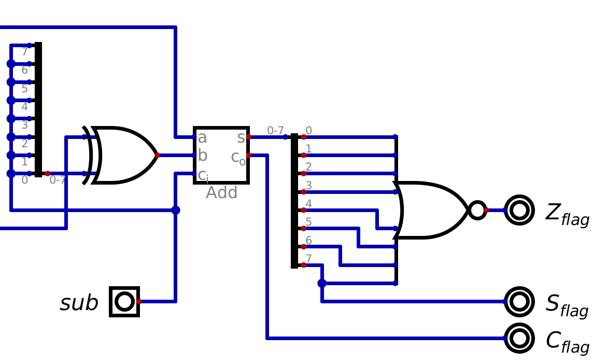
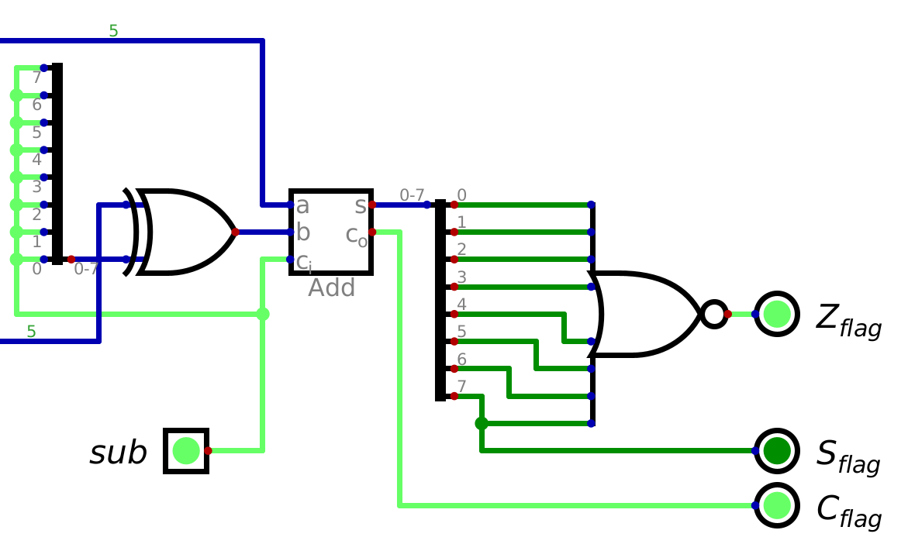
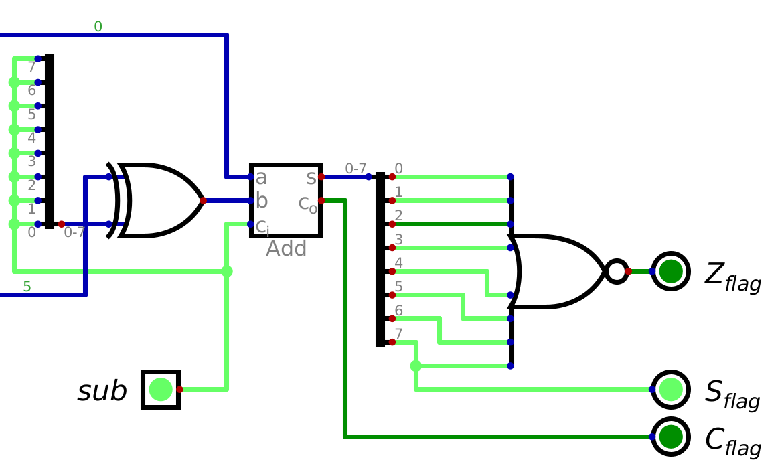
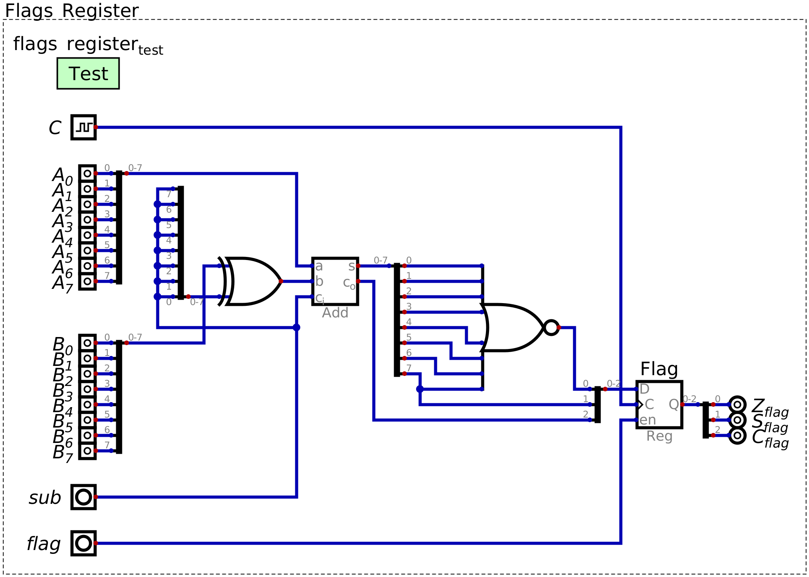

==========
Conditions
==========

* Although the system is programmable, it currently has a significant limitation
* To highlight this limitation, consider the problem the following problem

    * Given some number, output ``1`` if it is less than ``10``, otherwise, output ``0``


* It turns out that it's not possible as there is no way to check a condition

    * Think ``If`` statements


Conditional Jump Command
========================


Status Flags
------------


Flags Register
==============



    Status flag signals connected to an ALU. The output of the ALU would typically be sent back to the data bus, but
    here the output is ignored except for analysing the output's status for the purpose of determining the status flags.


* The goal is to know if the last arithmatic operation performed caused any of the status signals to change
* However, the adder is always outputting a value based on the contents of registers A and B

    * This is true, even when addition/subtraction is not intentionally being performed


* For example, consider the steps the system performs when calculating ``5 - 5``

    * Load ``5``` into A
    * Load ``-5`` into B
    * Set the subtraction signal

        * At this instant, the status flag signal for ``0`` should be high

            * The overflow will also be high too, as a consequence of 2s compliment arithmetic


    * Put value from ALU into A

        * At this instant, the status flag for ``0`` will be high
        * This is because the adder always calculates the sum/difference of the values in registers A and B
        * Therefore, since the ALU is outputting ``-5``, the zero flag is low, but the significant/sign flag is high
        * This second calculation was unintended and a consequence of the design of the system




    Status flag signals after the ALU calculates ``5 - 5``, but before the output of the ALU is sent back into register
    A. Notice that the zerp flag is high, since ``5 - 5 = 0``.




    Status flag signal after the result of ``5 - 5`` (``0``) is placed into register A. Since the ALU is always
    calculating the difference of the current values in registers A (now ``0``) and B (``5``), the value being output by
    the adder component will be ``(5 - 5) - 5``, or ``-5``. Because of this, the zero flag is no longer high, even
    though the last subtraction operation did result in a ``0``.


* The status signals are always changing, but these status signals are to be known at very specific times

    * As a result of the last operation
    * For example, when the intended ``5 - 5`` was computed, not the subsequent unintended operation


* In other words, there needs to be a way to preserve the status flag values when specific operations are done
* Like before, this can be achieved with a register --- a flag register

* The key is to carefully control when the register's inputs, the status flag signals, are actually stored

    * Only enable the flag resister to store the signals when performing addition or subtraction
    * In all other cases, the value being output by the adder component does not matter


* With this, all condition checks are based on the last arithmatic operation performed

    * The zero, significant/sign, and carry conditions


* Below is an example of an adder with logic for the status flag signals being fed into a flag register

    * Here, except for the status flags logic, the value of the output of the adder is ignored




    Configuration of an adder component with a status flag register. This design contains the logic to determine if any
    of the three status signals should be high based on the output of the adder. The value of the status signals can be
    latched into the flags register for later use.


For Next Time
=============

* Something?


