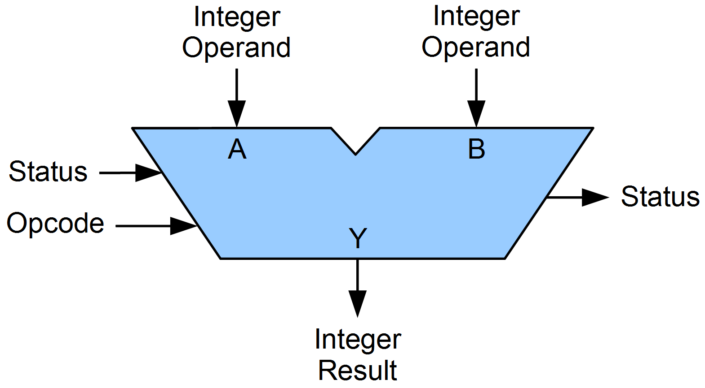
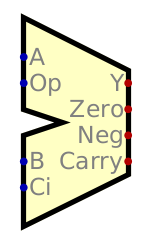
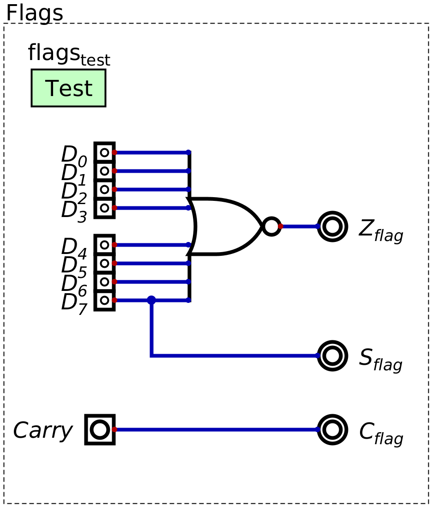

==========
Conditions
==========

* Although the system is programmable, it currently has a significant limitation
* To highlight this limitation, consider the problem the following problem

    * Given some number, output ``1`` if it is less than ``10``, otherwise, output ``0``

* It turns out that it's not possible as there is no way to check a condition

    * Think ``If`` statements

Conditional Jump Command
========================

* Consider the general idea of a program to check if a value is less than ``10``

    * Load value into register A
    * If register A's value is ``< 10``

        * Output ``1``
        * Halt

    * Otherwise

        * Output ``0``
        * ``Halt``

* Currently there is no way to have a program branch based on a condition

    * There is no ``if`` style instruction

* However, the current instruction set does include a jump instruction, which does provide some way to move around RAM
* Therefore, using the idea of a jump, the program can be reframed

    * Load value into register A
    * If register A's value is ``< 10``, jump to a part of RAM containing the following instruction

        * Output ``1``
        * Halt

    * Otherwise

        * Output ``0``
        * ``Halt``

    .. code-block:: text
        :linenos:

        v2.0 raw
        0x1F (load data from address 0xF into A)
        0x?4 (Jump to address 0x4 if < 10)
        0xDD (Output 0)
        0xF0 (Halt)
        0xDE (Output 1)
        0xF0 (Halt)
        0x00
        0x00
        0x00
        0x00
        0x00
        0x00
        0x00
        0x00 (0 to output if not < 10)
        0x01 (1 to output if < 10)
        0x?? (some number to check)

* Unfortunately, the jump instruction available in the current instruction set *always* jumps

    * There is no condition

* However, there is room to add to the instruction set
* Therefore, consider how this conditional jump idea *could* be done

    * What should the condition be?
    * How should the system handle it?

* Having a jump for a specific condition and value like ``< 10`` will work in this case, but it is not general
* Instead, one could checks for ``== 0`` or ``< 0`` as they are far more general and useful

    * For example, if one wants to check if some value is ``< 10``, simply check the difference

        * If ``(value - 10) < 0``, then ``value < 10``

.. note::

    Technically, the system only needs the ability to check 1 condition to be functionally complete. For example, only
    having the ability to check if a value is 0 would be enough for a system like this to compute anything computable.

    However, consider the number of steps required to check if a number is less than 10 with only the ability to check
    if some value is ``== 0`` versus the ability to check more conditional cases, like ``< 0``.

    Therefore, to increase flexibility and ease of programming, several conditions will be included in the ESAP system.

* Since the ESAP system is only 8 bits and overflows may be common, a check for an overflow may also be helpful
* Therefore, three conditions are to be included

    * If some value is 0
    * If some value is less than zero (negative)
    * If an overflow happened

* Checking an overflow is a little trickier than the other conditions

    * To check if a value is ``== 0`` or ``< 0``, look at the value
    * However, one cannot look at an 8 bit value and know if an overflow happened

* Instead, an overflow would have had to happen as the result of some arithmetic

    * Check the carry out of the adder

* In fact, all three conditions can be checked when some arithmetic

    * Is the result of the arithmetic ``== 0``?
    * Is the result ``< 0``?
    * Did it cause an overflow?

* Looking back at the ALU designs discussed, notice that they have more than one output signal

    Generic symbol for an ALU. Notice "Status" out.

    Digital's importable ALU. Notice the three output signals labelled "Zero", "Neg", and "Carry".

* It is now a matter of building the hardware for the system to check these conditions

Status Flags
------------

* Checking if a value is zero is a matter of checking if all the bits are ``0``

    * This can be done in several ways, but perhaps the easiest is with ``NOR``
    * Think of the ``NOR`` operator's truth table --- only ``1`` when all inputs are ``0``

* Checking if a number is negative is a little tricky because it requires one to know if the integer is signed or not

    * If it's a signed integer, and the most significant bit is a ``1``, then the number is negative
    * If it's an unsigned integer, then the value cannot be negative

* It would be the responsibility of the programmer to know if the data is signed as the system itself does not know

    * Remember, the bits are an encoding of some data
    * The meaning of data depends on what is being encoded/how it should be decoded

* Therefore, all the system can do is check the signal on the most significant bit
* Then the programmer, knowing the context in which they are using the system, can use this information

* Finally, knowing if an operation resulted in an overflow/carry is a matter of checking the carry signal from the adder

    Logic to check the various states. The :math:`Z_{flag}` is a signal indicating if some value is zero,
    :math:`S_{flag}` indicates if the most significant bit is high (which can be used to check if a value is negative),
    and :math:`C_{flag}` indicates if the carry bit is high. This :math:`C_{flag}` signal would be connected to the
    adder's carry out signal.

Flags Register
==============

For Next Time
=============

* Something?

