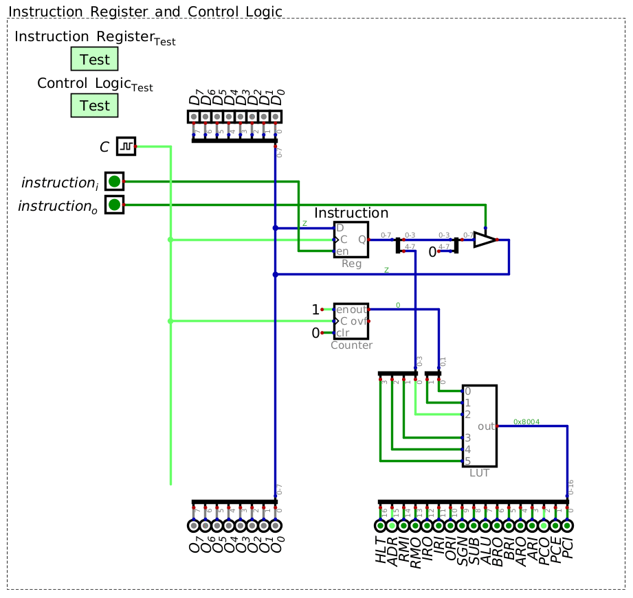

=============
Control Logic
=============

* Instructions are fetched and put into the instruction register for processing

    * An instruction set has already been defined
    * Each instruction's microcodes are known

        * How the hardware is manipulated for each instruction

* However, there is still no way for the system to manipulate its own control logic

    * There is no way for the system to take an instruction and then activate/deactivate the various hardware modules

* In other words, how can the system know how to physically perform an instruction

Instruction and Microcode Steps
===============================

Look Up Table to Process Instruction
====================================

* Given the 16 instructions, each with 4 microcode steps, there are a total of 64 rows in the look up table

    * Each of these rows contains binary patterns controlling many control signals

* One could write out the look up table by hand, but this would be tedious
* Therefore, a script will be create to programmatically generate the hex file for the look up table

    * Similar to how it was done for the seven segment display patterns

* With the current configuration of the ESAP system, a total of 17 control signals exist
* Therefore, the look up table will have a 17 bit output where each bit corresponds to a specific control signal
* Below is a series of constants labelling each of the 17 bits

.. literalinclude:: create_control_logic_patterns_for_look_up_table.py
    :language: python
    :lineno-match:
    :start-after: # [begin-control_signal_pattern_constants]
    :end-before: # [end-control_signal_pattern_constants]

* Here, the most significant bit of the 17 output bits controls the :math:`Halt` signal

    * :math:`Halt` has yet to be discussed, but will deactivate the system's clock, thereby halting the program

* The least significant bit controls the :math:`PC_{i}` signal

* The actual order of these signals does not really matter

    * The fact that :math:`Halt` is the most significant bit is by no means necessary
    * All that matters is that each signal connects to the corresponding module in the ESAP system
    * Here, the order is set for visual clarity and symmetry of the control bus

* With these constants set, one can easily create microcodes by performing bitwise ``OR`` on the constants

    * For example, to create the microcode for "Instruction Register -> Address Register" --- ``IRO|ADR``
    * This creates the full 17 bit binary pattern to activate the corresponding modules for the microcode

        * ``IRO|ADR``
        * ``0_00010000_00000000 | 0_10000000_00000000``
        * ``0_10010000_00000000``

* Each of the 16 instructions will be a collection of up to 4 groups of specific constants ``OR``\ed together

* Below, the instructions are stored in a list of 16 lists of length 4

    * Each list of length 4 corresponds to the 4 microcodes for a specific instruction
    * Each of the 16 lists of length 4 corresponds to a specific instruction

.. literalinclude:: create_control_logic_patterns_for_look_up_table.py
    :language: python
    :lineno-match:
    :start-after: # [begin-instruction_microcodes]
    :end-before: # [end-instruction_microcodes]

* Notice that each of the 16 instructions start with the same two microcodes

    * ``PCO|ADR`` and ``RMO|IRI|PCE``
    * These are the two microcodes of the fetch cycle
    * This way, no matter what operator value is in the instruction register, fetch happens the same way

* With all microcodes set for each instruction, the list of instructions can be written as hex values to an output file

.. literalinclude:: create_control_logic_patterns_for_look_up_table.py
    :language: python
    :lineno-match:
    :start-after: # [begin-save_to_file]
    :end-before: # [end-save_to_file]

* This file can be loaded into the control logic's look up table
* With this, the look up table can now map the input (operator + microcode step) to the 17 bit control signal pattern

    Control logic look up table outputting the 17 control signals for the four microcode steps of the instruction
    ``0001`` (``LDAR``).

Including the Control Logic Module in the System
================================================

For Next Time
=============

* Something?

