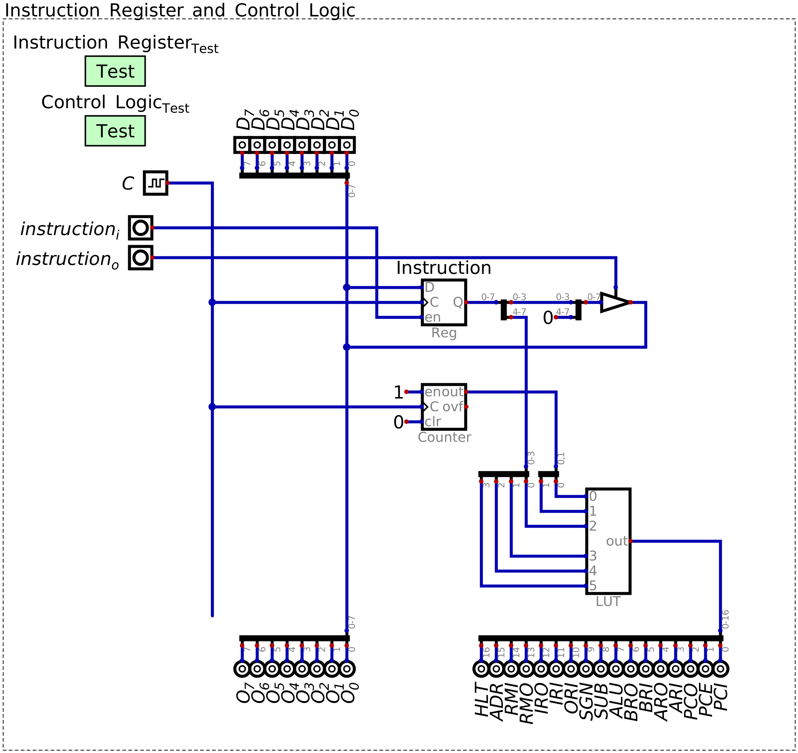
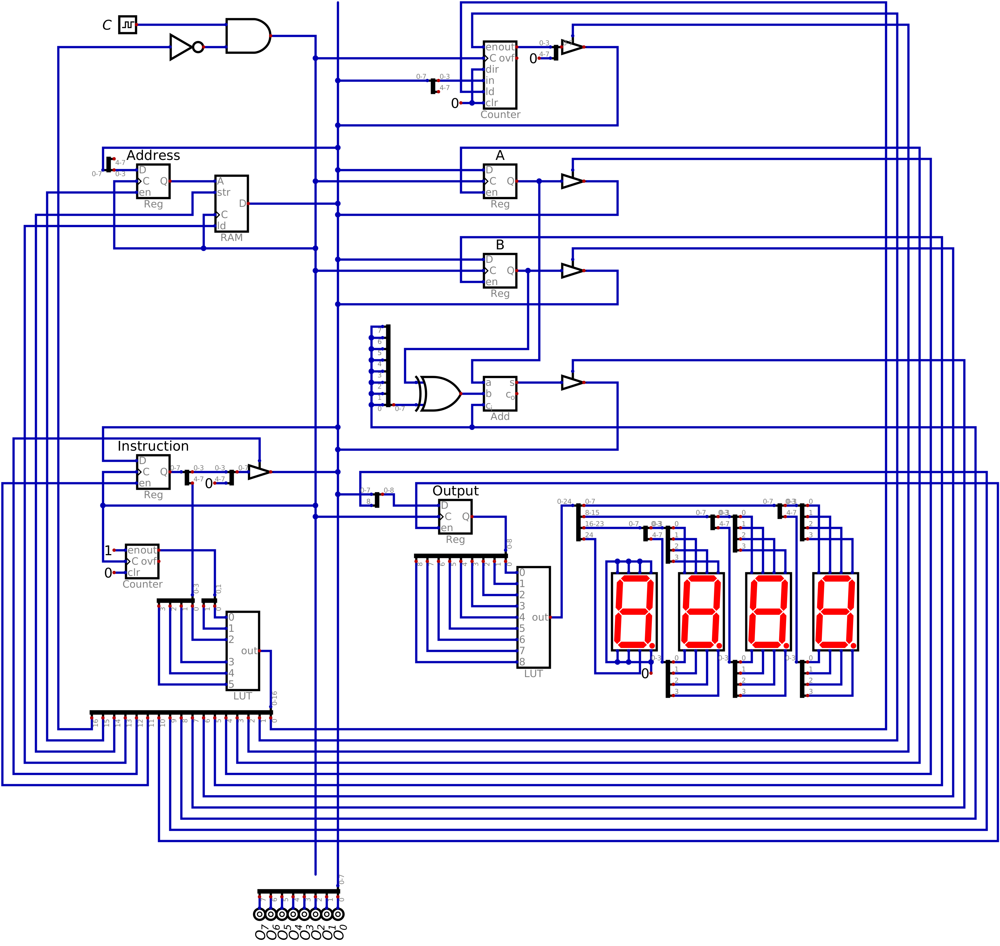
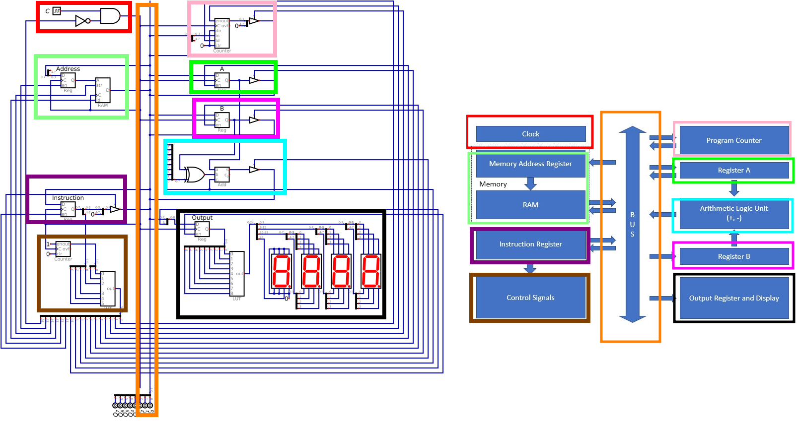

=============
Control Logic
=============

* Instructions are fetched and put into the instruction register for processing

    * An instruction set has already been defined
    * Each instruction's microcodes are known

        * How the hardware is manipulated for each instruction

* However, there is still no way for the system to manipulate its own control logic

    * There is no way for the system to take an instruction and then activate/deactivate the various hardware modules

* In other words, how can the system know how to physically perform an instruction?

Instruction and Microcode Steps
===============================

.. figure:: instruction_register.png
    :width: 500 px
    :align: center

    The instruction register stores the operator and operand of the current instruction. The operand is output to the
    bus for use during the execution of the instruction. The operator remains in the register for processing.

* Consider what is stored in the instruction register and what is being output

    * The operator, specifying some instruction to execute

        * The most significant four bits in the instruction

    * The operand, specifying some data for use in execution of the specific instruction

        * The least significant four bits in the instruction

* As previously discussed, each instruction requires several steps

    * For example, loading data into register A from RAM (``LDAR/0001``)

        * Output the operand from the instruction register and put it into the address register
        * Output the value from the specified RAM address to the A register

* Additionally, before any processing of any instruction can occur, it must be fetched from RAM

    * No matter what instruction is to be executed, the two steps in the fetch cycle must happen

* In other words, instructions require several steps

Microcode Counter
-----------------

* The operator can be used to specify the steps to be executed in order to perform the instruction

    * The operator would manipulate the control signals for the system

* Thus, a look up table can be used to find the steps required to perform the full instruction

    * Input to the look up table is the operand, output is the control signals

* However, there is a problem with this idea since instruction may require several sequential steps too complete

    * The microcodes

* Consider the below table of the 4 microcode steps required for loading data from RAM to register A

    * The first two steps are the fetch cycle
    * The latter two steps move dara from the specified RAM address to register A

.. list-table:: Full control logic of ``LDAR``
    :widths: auto
    :align: center
    :header-rows: 1

    * - :math:`Address`
      - :math:`RAM`
      - :math:`A`
      - :math:`B`
      - :math:`ALU`
      - :math:`out`
      - :math:`PC`
      - :math:`Instruction`
    * - ``1``
      - ``0/0``
      - ``0/0``
      - ``0/0``
      - ``0/0``
      - ``0/0``
      - ``0/1/0``
      - ``0/0``
    * - ``0``
      - ``0/1``
      - ``0/0``
      - ``0/0``
      - ``0/0``
      - ``0/0``
      - ``0/0/1``
      - ``1/0``
    * - ``1``
      - ``0/0``
      - ``0/0``
      - ``0/0``
      - ``0/0``
      - ``0/0``
      - ``0/0/0``
      - ``0/1``
    * - ``0``
      - ``0/1``
      - ``1/0``
      - ``0/0``
      - ``0/0``
      - ``0/0``
      - ``0/0/0``
      - ``0/0``

* Not all instructions require 4 steps

    * 1 instruction (``NOOP``) takes 2 microcode steps (fetch only)
    * Six instructions take 3 steps
    * Six instructions take 4 steps

* For simplicity and consistency, consider each instruction as a group of 4 steps
* Below is a table of the microcode steps of the first 3 instructions in the instruction set

    * ``NOOP``
    * ``LDAR``
    * ``LDAD``

.. list-table:: Operator and steps for control logic
    :widths: auto
    :align: center
    :header-rows: 1

    * - Operator
      - Microcode Step
      -
      - Control Logic
    * - ``0000``
      - ``00``
      -
      - Program Counter -> Address Register
    * - ``0000``
      - ``01``
      -
      - RAM -> Instruction Register, Enable Program Counter
    * - ``0000``
      - ``10``
      -
      - Nothing
    * - ``0000``
      - ``11``
      -
      - Nothing
    * -
      -
      -
      -
    * - ``0001``
      - ``00``
      -
      - Program Counter -> Address Register
    * - ``0001``
      - ``01``
      -
      - RAM -> Instruction Register, Enable Program Counter
    * - ``0001``
      - ``10``
      -
      - Instruction Register -> Address Register
    * - ``0001``
      - ``11``
      -
      - RAM -> Register A
    * -
      -
      -
      -
    * - ``0010``
      - ``00``
      -
      - Program Counter -> Address Register
    * - ``0010``
      - ``01``
      -
      - RAM -> Instruction Register, Enable Program Counter
    * - ``0010``
      - ``10``
      -
      - Instruction Register -> Register A
    * - ``0010``
      - ``11``
      -
      - Nothing
    * - ...
      - ...
      -
      - ...

* Each operator specifies a grouping of microcodes
* Each microcode can be identified by the microcode step count

* Considering the operand and microcode step together, there is a unique identifier for each instruction's microcode

    * A unique six bit identifier
    * Four bits for the operator, two for the microcode step

* Therefore, given a mechanism to keep track of the microcode step, a look up table may still be used

    * Map the operand + microcode counter to the control logic for the specific microcode step

* Fortunately, there is a simple way to keep track of the microcode steps --- a counter

    * Like the program counter

* This counter will be referred to as the microcode counter

    Operator from the instruction register and microcode step count from the microcode counter used as input to a look
    up table containing the control signals. The input to the look up table would map to the control signals for the
    specific operator's current microcode step.

* Unlike the program counter, this microcode counter will count at every clock pulse

    * The program counter only counted when enabled since each individual instruction may take several clock pulses
    * The microcode counter keeps track of each microcode step, each taking one clock pulse

.. note::

    Since several instructions takes less than four clock cycles, one may have noticed that the system would be wasting
    clock cycles; the system would be doing nothing for a clock pulse. What are some ways this could be addressed?

Look Up Table to Process Instruction
====================================

* Given the 16 instructions, each with 4 microcode steps, there are a total of 64 rows in the look up table

    * Each of these rows contains binary patterns controlling many control signals

* One could write out the look up table by hand, but this would be tedious
* Therefore, a script will be create to programmatically generate the hex file for the look up table

    * Similar to how it was done for the seven segment display patterns

* With the current configuration of the ESAP system, a total of 17 control signals exist
* Therefore, the look up table will have a 17 bit output where each bit corresponds to a specific control signal
* Below is a series of constants labelling each of the 17 bits

.. literalinclude:: create_control_logic_patterns_for_look_up_table.py
    :language: python
    :lineno-match:
    :start-after: # [begin-control_signal_pattern_constants]
    :end-before: # [end-control_signal_pattern_constants]

* Here, the most significant bit of the 17 output bits controls the :math:`Halt` signal

    * :math:`Halt` has yet to be discussed, but will deactivate the system's clock, thereby halting the program

* The least significant bit controls the :math:`PC_{i}` signal

* The actual order of these signals does not really matter

    * The fact that :math:`Halt` is the most significant bit is by no means necessary
    * All that matters is that each signal connects to the corresponding module in the ESAP system
    * Here, the order is set for visual clarity and symmetry of the control bus

* With these constants set, one can easily create microcodes by performing bitwise ``OR`` on the constants

    * For example, to create the microcode for "Instruction Register -> Address Register" --- ``IRO|ADR``
    * This creates the full 17 bit binary pattern to activate the corresponding modules for the microcode

        * ``IRO|ADR``
        * ``0_00010000_00000000 | 0_10000000_00000000``
        * ``0_10010000_00000000``

* Each of the 16 instructions will be a collection of up to 4 groups of specific constants ``OR``\ed together

* Below, the instructions are stored in a list of 16 lists of length 4

    * Each list of length 4 corresponds to the 4 microcodes for a specific instruction
    * Each of the 16 lists of length 4 corresponds to a specific instruction

.. literalinclude:: create_control_logic_patterns_for_look_up_table.py
    :language: python
    :lineno-match:
    :start-after: # [begin-instruction_microcodes]
    :end-before: # [end-instruction_microcodes]

* Notice that each of the 16 instructions start with the same two microcodes

    * ``PCO|ADR`` and ``RMO|IRI|PCE``
    * These are the two microcodes of the fetch cycle
    * This way, no matter what operator value is in the instruction register, fetch happens the same way

* With all microcodes set for each instruction, the list of instructions can be written as hex values to an output file

.. literalinclude:: create_control_logic_patterns_for_look_up_table.py
    :language: python
    :lineno-match:
    :start-after: # [begin-save_to_file]
    :end-before: # [end-save_to_file]

* This file can be loaded into the control logic's look up table
* With this, the look up table can now map the input (operator + microcode step) to the 17 bit control signal pattern

.. figure:: control_logic_0001.gif
    :width: 666 px
    :align: center

    Control logic look up table outputting the 17 control signals for the four microcode steps of the instruction
    ``0001`` (``LDAR``).

Including the Control Logic Module in the System
================================================

* Adding the control logic look up table to the system requires a reconfiguration of the control signals

    * The toggles for each control signal is removed as each signal is connected to the output of the look up table

    Configuration of the ESAP system with the ALU, RAM, output, program counter, instruction register and control logic
    modules connected.

* In addition to connecting the control signals, logic was added to the system to control when the clock is active

    * This allows for the :math:`Halt` signal to halt the system
    * When :math:`Halt` is high, the clock is disabled
    * This is achieved by inverting the :math:`Halt` signal and ``AND``\ing it with the clock signal

* Further, the data input toggles were removed from the top of the bus since there is no need for them anymore

    * All data the system needs will be programmed into RAM
    * There will be no need to add data to these lines while the system is running

    Comparison of the current system with the control logic and the ESAP architecture overview.

For Next Time
=============

* Something?

