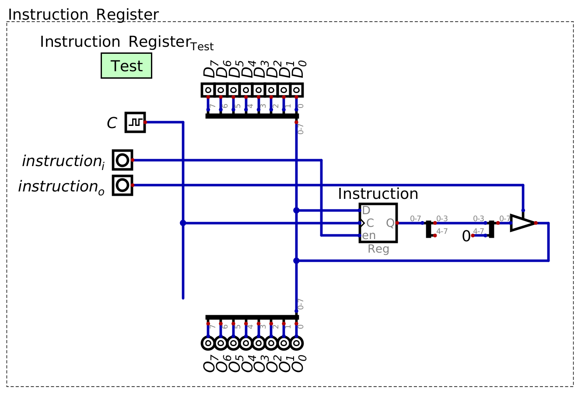

=============
Control Logic
=============

* Instructions are fetched and put into the instruction register for processing

    * An instruction set has already been defined
    * Each instruction's microcodes are known

        * How the hardware is manipulated for each instruction

* However, there is still no way for the system to manipulate its own control logic

    * There is no way for the system to take an instruction and then activate/deactivate the various hardware modules

* In other words, how can the system know how to physically perform an instruction?

Instruction and Microcode Steps
===============================

    The instruction register stores the operator and operand of the current instruction. The operand is output to the
    bus for use during the execution of the instruction. The operator remains in the register for processing.

* Consider what is stored in the instruction register and what is being output

    * The operator, specifying some instruction to execute

        * The most significant four bits in the instruction

    * The operand, specifying some data for use in execution of the specific instruction

        * The least significant four bits in the instruction

* As previously discussed, each instruction requires several steps

    * For example, loading data into register A from RAM (``LDAR/0001``)

        * Output the operand from the instruction register and put it into the address register
        * Output the value from the specified RAM address to the A register

* Additionally, before any processing of any instruction can occur, it must be fetched from RAM

    * No matter what instruction is to be executed, the two steps in the fetch cycle must happen

* In other words, instructions require several steps

Microcode Counter
-----------------

* The operator can be used to specify the steps to be executed in order to perform the instruction

    * The operator would manipulate the control signals for the system

* Thus, a look up table can be used to find the steps required to perform the full instruction

    * Input to the look up table is the operand, output is the control signals

* However, there is a problem with this idea since instruction may require several sequential steps too complete

    * The microcodes

* Consider the below table of the 4 microcode steps required for loading data from RAM to register A

    * The first two steps are the fetch cycle
    * The latter two steps move dara from the specified RAM address to register A

.. list-table:: Full control logic of ``LDAR``
    :widths: auto
    :align: center
    :header-rows: 1

    * - :math:`Address`
      - :math:`RAM`
      - :math:`A`
      - :math:`B`
      - :math:`ALU`
      - :math:`out`
      - :math:`PC`
      - :math:`Instruction`
    * - ``1``
      - ``0/0``
      - ``0/0``
      - ``0/0``
      - ``0/0``
      - ``0/0``
      - ``0/1/0``
      - ``0/0``
    * - ``0``
      - ``0/1``
      - ``0/0``
      - ``0/0``
      - ``0/0``
      - ``0/0``
      - ``0/0/1``
      - ``1/0``
    * - ``1``
      - ``0/0``
      - ``0/0``
      - ``0/0``
      - ``0/0``
      - ``0/0``
      - ``0/0/0``
      - ``0/1``
    * - ``0``
      - ``0/1``
      - ``1/0``
      - ``0/0``
      - ``0/0``
      - ``0/0``
      - ``0/0/0``
      - ``0/0``

* Not all instructions require 4 steps

    * 1 instruction (``NOOP``) takes 2 microcode steps (fetch only)
    * Six instructions take 3 steps
    * Six instructions take 4 steps

* For simplicity and consistency, consider each instruction as a group of 4 steps
* Below is a table of the microcode steps of the first 3 instructions in the instruction set

    * ``NOOP``
    * ``LDAR``
    * ``LDAD``

.. list-table:: Operator and steps for control logic
    :widths: auto
    :align: center
    :header-rows: 1

    * - Operator
      - Microcode Step
      -
      - Control Logic
    * - ``0000``
      - ``00``
      -
      - Program Counter -> Address Register
    * - ``0000``
      - ``01``
      -
      - RAM -> Instruction Register, Enable Program Counter
    * - ``0000``
      - ``10``
      -
      - Nothing
    * - ``0000``
      - ``11``
      -
      - Nothing
    * -
      -
      -
      -
    * - ``0001``
      - ``00``
      -
      - Program Counter -> Address Register
    * - ``0001``
      - ``01``
      -
      - RAM -> Instruction Register, Enable Program Counter
    * - ``0001``
      - ``10``
      -
      - Instruction Register -> Address Register
    * - ``0001``
      - ``11``
      -
      - RAM -> Register A
    * -
      -
      -
      -
    * - ``0010``
      - ``00``
      -
      - Program Counter -> Address Register
    * - ``0010``
      - ``01``
      -
      - RAM -> Instruction Register, Enable Program Counter
    * - ``0010``
      - ``10``
      -
      - Instruction Register -> Register A
    * - ``0010``
      - ``11``
      -
      - Nothing
    * - ...
      - ...
      -
      - ...

* Each operator specifies a grouping of microcodes
* Each microcode can be identified by the microcode step count

* Considering the operand and microcode step together, there is a unique identifier for each instruction's microcode

    * A unique six bit identifier
    * Four bits for the operator, two for the microcode step

* Therefore, given a mechanism to keep track of the microcode step, a look up table may still be used

    * Map the operand + microcode counter to the control logic for the specific microcode step

* Fortunately, there is a simple way to keep track of the microcode steps --- a counter

    * Like the program counter

* This counter will be referred to as the microcode counter

    Operator from the instruction register and microcode step count from the microcode counter used as input to a look
    up table containing the control signals. The input to the look up table would map to the control signals for the
    specific operator's current microcode step.

* Unlike the program counter, this microcode counter will count at every clock pulse

    * The program counter only counted when enabled since each individual instruction may take several clock pulses
    * The microcode counter keeps track of each microcode step, each taking one clock pulse

.. note::

    Since several instructions takes less than four clock cycles, one may have noticed that the system would be wasting
    clock cycles; the system would be doing nothing for a clock pulse. What are some ways this could be addressed?

Look Up Table to Process Instruction
====================================

Including the Control Logic Module in the System
================================================

For Next Time
=============

* Something?

