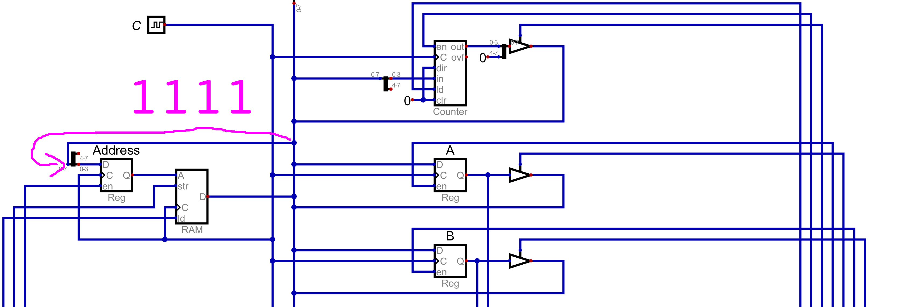
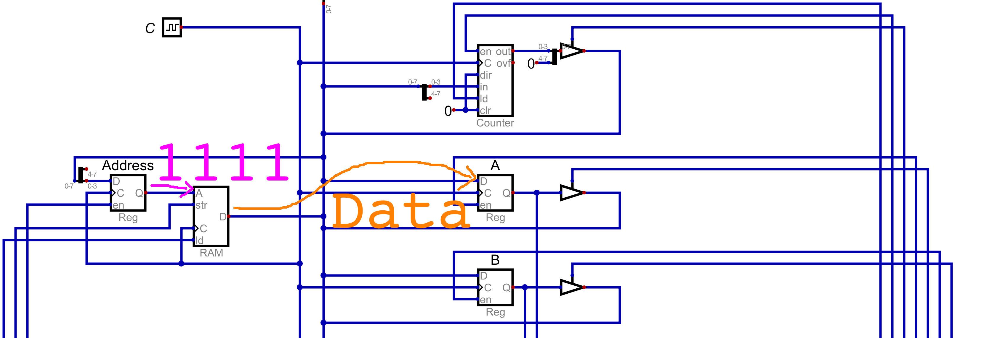

===========================
Instructions and Microcodes
===========================

* Although RAM has currently only held data, computation has been performed on the system
* With careful manipulation of the control signals, specific operations were executed by the system

    * Reading and writing to RAM
    * Performing arithmetic
    * Outputting values
    * Looping

* Realizing this, it becomes possible to create a set of well defined instructions for the system

Constraints
===========

* The designers of the computer (us) decide what instructions to include and how they are to be performed
* However, it is important to consider the limitations and constraints of the system

* Although the ESAP system is to be fully functional computer, it is limited by the fact that it's an 8 bit system

    * RAM is byte addressable
    * The main bus is 8 bits wide

* Thus, the information on the bus can only be 8 bits

    * This information includes data
    * But also includes *instructions*

* Details on what the instructions are and how the system deals with them will be covered later
* For now, consider that, for the ESAP system, individual instructions for the system will be made up of two parts

    * Operator (specifying an operation)
    * Operand

* For example, imagine an instruction to load data from a RAM address into register A

    * The operator is --- load data into register A
    * The operand is --- the RAM address of the data to be loaded into register A

* This means, there needs to be a way to encode the operator and the operand into the 8 bits

    * There needs to be a way to encode *load into A* and *the memory address of the data to load into A*

* A design decision must be made here --- how many bits for each of the two parts?

* For the ESAP system, the most significant 4 bits will be for the operator, and the remaining 4 will be for the operand

    * This means, a total of 16 unique operators and 16 unique operands can be represented
    * If the operand is a memory address, with 16 unique values, only 16 memory address may be indexed

        * This is why the system was designed with only 16 bytes or RAM

    The ESAP system's 8 bit instruction broken down into the two parts --- operator and operand. The 4 most significant
    bits, represented as ``XXXX`` would specify some operator, while the 4 least significant bits, represented as
    ``YYYY`` would be the operand.

* Ultimately, it is possible to have different breakdowns of the 8 bits

    * For example, 3 and 5 could have been used for the operator and operands respectively

        * 3 bits for the operator --- 8 total
        * 5 bits for the operand --- 32 total

* But there is always going to be a trade off

    * Less vs. more flexibility with the number of operators, at the cost/benefit of operands and address space

* As previously mentioned, more details are to come on how the system encodes and manages the instructions
* For now, the takeaway is understanding how the 8 bits constrains the system's instructions

Microcodes
==========

* In several previous topics, it was observed that instructions were performed by moving data around the system

    * Moving data around to different modules
    * Some modules output data, while others input

* Consider the instruction of loading data from some memory address into register A

    * Any of the 16 memory addresses could be used in this example, but ``15`` (``0b1111``) is used here

* Think about the steps involved to perform this instruction within the context of the ESAP system design

    #. Load the value of the target memory address (``0b1111``) from the bus into the memory address register
    #. Output the value stored in RAM to the bus and input the value from the bus into register A

    Subsection of the ESAP system so far, corresponds to step 1 above. From the bus, load into the memory address
    register the address of the data to be accessed from RAM. Here, the address is ``15``, or ``0b1111``.

    Subsection of the ESAP system so far, corresponds to step 2 above. Output the data stored in RAM address ``15``
    (``0b1111``) to the bus, and input the data from the bus into register A.

* Below is a table showing how the control lines would be configured for the two steps

    * The data and clock columns are excluded
    * Like before, each row corresponds to one clock cycle

.. list-table:: Control logic for loading data from some memory address to register A
    :widths: auto
    :align: center
    :header-rows: 1

    * - :math:`Address`
      - :math:`RAM`
      - :math:`A`
      - :math:`B`
      - :math:`ALU_{o}`
      - :math:`sub`
      - :math:`out_{i}`
      - :math:`sign`
      - :math:`PC`
      - :math:`PC_e`
    * - ``1``
      - ``0/0``
      - ``0/0``
      - ``0/0``
      - ``0``
      - ``0``
      - ``0``
      - ``0``
      - ``0/0``
      - ``0``
    * - ``0``
      - ``0/1``
      - ``1/0``
      - ``0/0``
      - ``0``
      - ``0``
      - ``0``
      - ``0``
      - ``0/0``
      - ``0``

* These two steps put together achieve the instruction of loading data from a specific RAM address into register A
* The steps individual steps are called *microcodes*
* Each of these microcodes took one clock cycle

* Most instructions are made up of several microcodes

    * These instructions would be things like loading data from RAM, addition, outputting data, etc.
    * Additional instructions are to be discussed shortly

* Thus, individual instructions may take multiple clock cycles

Fetch and Instruction Register
==============================

Instruction Set
===============

* The instruction set is a collection of instructions the computer can execute on the hardware

    * Like the example instruction discussed, loading data from RAM into register A

* As discussed, with 4 bit operators, a total of 16 unique instructions can be implemented for the ESAP system

    * Each of the 16 instructions can be uniquely identified with a bit pattern

* The specific instructions included in the instruction set is up to the designers of the system (us)

    * The designers get to decide which instructions the computational system can perform
    * Assuming the hardware is sufficient to perform such an instruction

* Below are 13 instructions that can be included on the system

    * This leaves room for additional instructions to be added to the instruction set later

* These 13 were chosen to balance a few considerations

    * Small number of instructions while still providing a breadth of functionality
    * Minimizes the amount of RAM required to describe a whole program
    * Minimizes the number of clock cycles/microcodes the instructions take

* Further, the 13 instructions that are included may be changed at a later time by the designers

    * One may discover that certain instructions are redundant or entirely unnecessary
    * Refining the instruction set may allow for more, different and useful instructions to be included
    * The process of refining the instruction set is a form of optimization for computational systems

* How each instruction's bit pattern ultimately manages the control logic of the system will be discussed later
* Here, only the instructions, along with their bit pattern, are presented

    * For the ESAP system, the instruction's bit pattern is somewhat arbitrary
    * What matters is that each bit pattern uniquely identifies an instruction

The 13 Instructions
-------------------

* Below is a table summarizing the instruction set
* Following the table is a description of each instruction

.. list-table:: An Instruction Set for the Current ESAP System
    :widths: auto
    :align: center
    :header-rows: 1

    * - Bit Pattern
      - Hex
      - Label
      - Description
    * - ``0000``
      - ``0``
      - ``NOOP``
      - No Operation
    * - ``0001``
      - ``1``
      - ``LDAR``
      - Load A From RAM
    * - ``0010``
      - ``2``
      - ``LDAD``
      - Load A Direct
    * - ``0011``
      - ``3``
      - ``LDBR``
      - Load B From RAM
    * - ``0100``
      - ``4``
      - ``LDBD``
      - Load B Direct
    * - ``0101``
      - ``5``
      - ``SAVA``
      - Save A to RAM
    * - ``0110``
      - ``6``
      - ``SAVB``
      - Save B to RAM
    * - ``0111``
      - ``7``
      - ``ADAB``
      - Add B to A --- ``A += B``
    * - ``1000``
      - ``8``
      - ``SUAB``
      - Subtract B from A --- ``A -= B``
    * - ``1001``
      - ``9``
      - ``JMPA``
      - Jump Always
    * - ``1010``
      - ``A``
      - ``NOOP``
      - No Operation
    * - ``1011``
      - ``B``
      - ``NOOP``
      - No Operation
    * - ``1100``
      - ``C``
      - ``NOOP``
      - No Operation
    * - ``1101``
      - ``D``
      - ``OUTU``
      - Output Unsigned Integer
    * - ``1110``
      - ``E``
      - ``OUTS``
      - Output Signed Integer
    * - ``1111``
      - ``F``
      - ``HALT``
      - Halt

* ``0000`` --- ``NOOP``

    * No Operation
    * An instruction that takes a known number of clock cycles, but ultimately means *do nothing*
    * This may seem silly, but there are practical reasons for this operation
    * For the ESAP system, this operation can be used as a time delay

* ``0001`` --- ``LDAR``

    * Load data into register A from some specified RAM address
    * The 4 bit operand for this instruction specifies some memory address to read the data from

        * Consider the full 8 bit instruction ``0001 YYYY``
        * ``0001``, the operator, specifies the ``LDAR`` instruction
        * ``YYYY``, the operand, would be the memory address to read the data from

    * The high level microcode steps would be as follows

        * Output the operand (memory address) from the instruction register and put it into the address register
        * Output the value from RAM and put it into register A

* ``0010`` --- ``LDAD``

    * Load the provided data directly into register A
    * The 4 bit operand for this instruction is the data to be loaded into RAM

        * Can only load 4 bit data into RAM through this instruction

    * Reduces the amount of RAM needed for loading data into register A when working with small numbers

        * Consider that ``LDAR`` requires 2 memory addresses

            * One for the instruction
            * Another for the memory address of the data to be loaded into A

    * The high level microcode steps would be as follows

        * Output the operand (data) from the instruction register and put it into register A

* ``0011`` --- ``LDBR``

    * Load data into register B from some specified RAM address
    * Similar to ``LDAR``

* ``0100`` --- ``LDBD``

    * Load the provided data directly into register B
    * Similar to ``LDAD``

* ``0101`` --- ``SAVA``

    * Save the data from register A to some specified RAM address
    * The 4 bit operand for this instruction specifies some memory address to write the data to
    * The high level microcode steps would be as follows

        * Output the operand (memory address) from the instruction register and put it into the address register
        * Output the value from the A register and put it into RAM

* ``0110`` --- ``SAVB``

    * Save the data from register B to some specified RAM address
    * Similar to ``SAVA``

* ``0111`` --- ``ADAB``

    * Add the contents of register B to register A --- ``A += B``
    * This overwrites the contents of register A
    * This instruction has no operand
    * The high level microcode steps would be as follows

        * Output sum from the ALU and put it into register A

* ``1000`` --- ``SUAB``

    * Subtract the contents of register B from register A  --- ``A -= B``
    * This overwrites the contents of register A
    * This instruction has no operand
    * The high level microcode steps would be as follows

        * Set the subtraction signal high and output difference from the ALU and put it into register A

* ``1001`` --- ``JMPA``

    * Jump to the instruction at the specified memory address
    * This sets the program counter to the specified address such that it stores the next instruction to be run
    * The 4 bit operand for this instruction specifies the memory address to jump to

        * The address of the instruction to run next

    * The high level microcode steps would be as follows

        * Output the operand (address to jump to) from the instruction register and put it into the program counter

* ``1010``, ``1011``, and ``1100`` --- ``NOOP``

    * No Operation
    * Same as ``0000`` above
    * Left open for potential additional instructions

* ``1101`` --- ``OUTU``

    * Output data as an unsigned integer from some specified RAM address
    * The 4 bit operand for this instruction specifies some memory address of the data to be output
    * The high level microcode steps would be as follows

        * Output the operand (memory address) from the instruction register and put it into the address register
        * Output the value from RAM and put it into the output register

* ``1110`` --- ``OUTS``

    * Output data as a signed integer from some specified RAM address
    * Similar to ``OUTU``
    * The high level microcode steps would be as follows

        * Output the operand (memory address) from the instruction register and put it into the address register
        * Set the sign signal high and output the value from RAM and put it into the output register

* ``1111`` --- ``HALT``

    * Stop the program
    * This will effectively deactivate the clock
    * The high level microcode steps would be as follows

        * Send some control signal to turn deactivate the clock

.. admonition:: Activity

    Consider the ESAP system's current hardware.

        #. What other instructions could be included?
        #. What variations of the existing instructions could be included?

For Next Time
=============

* Something?

