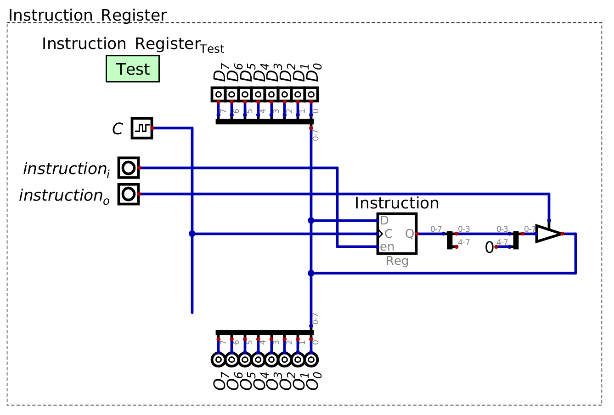
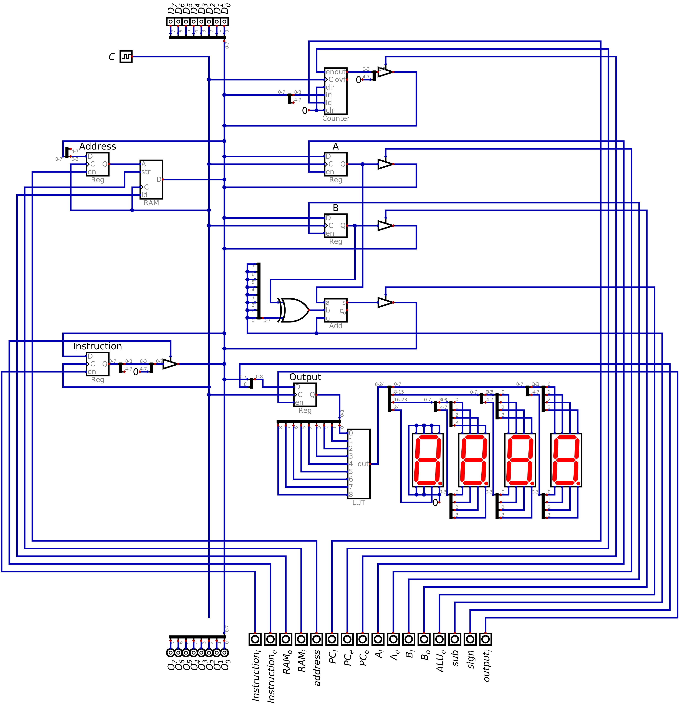

===========================
Instructions and Microcodes
===========================

* Although RAM has currently only held data, computation has been performed on the system
* With careful manipulation of the control signals, specific operations were executed by the system

    * Reading and writing to RAM
    * Performing arithmetic
    * Outputting values
    * Looping

* Realizing this, it becomes possible to create a set of well defined instructions for the system

Constraints
===========

* The designers of the computer (us) decide what instructions to include and how they are to be performed
* However, it is important to consider the limitations and constraints of the system

* Although the ESAP system is to be fully functional computer, it is limited by the fact that it's an 8 bit system

    * RAM is byte addressable
    * The main bus is 8 bits wide

* Thus, the information on the bus can only be 8 bits

    * This information includes data
    * But also includes *instructions*

* Details on what the instructions are and how the system deals with them will be covered later
* For now, consider that, for the ESAP system, individual instructions for the system will be made up of two parts

    * Operator (specifying an operation)
    * Operand

* For example, imagine an instruction to load data from a RAM address into register A

    * The operator is --- load data into register A
    * The operand is --- the RAM address of the data to be loaded into register A

* This means, there needs to be a way to encode the operator and the operand into the 8 bits

    * There needs to be a way to encode *load into A* and *the memory address of the data to load into A*

* A design decision must be made here --- how many bits for each of the two parts?

* For the ESAP system, the most significant 4 bits will be for the operator, and the remaining 4 will be for the operand

    * This means, a total of 16 unique operators and 16 unique operands can be represented
    * If the operand is a memory address, with 16 unique values, only 16 memory address may be indexed

        * This is why the system was designed with only 16 bytes or RAM

.. figure:: instruction_operator_operand.png
    :width: 333 px
    :align: center

    The ESAP system's 8 bit instruction broken down into the two parts --- operator and operand. The 4 most significant
    bits, represented as ``XXXX`` would specify some operator, while the 4 least significant bits, represented as
    ``YYYY`` would be the operand.

* Ultimately, it is possible to have different breakdowns of the 8 bits

    * For example, 3 and 5 could have been used for the operator and operands respectively

        * 3 bits for the operator --- 8 total
        * 5 bits for the operand --- 32 total

* But there is always going to be a trade off

    * Less vs. more flexibility with the number of operators, at the cost/benefit of operands and address space

* As previously mentioned, more details are to come on how the system encodes and manages the instructions
* For now, the takeaway is understanding how the 8 bits constrains the system's instructions

Microcodes
==========

* In several previous topics, it was observed that instructions were performed by moving data around the system

    * Moving data around to different modules
    * Some modules output data, while others input

* Consider the instruction of loading data from some memory address into register A

    * Any of the 16 memory addresses could be used in this example, but ``15`` (``0b1111``) is used here

* Think about the steps involved to perform this instruction within the context of the ESAP system design

    #. Load the value of the target memory address (``0b1111``) from the bus into the memory address register
    #. Output the value stored in RAM to the bus and input the value from the bus into register A

.. figure:: esap_in_memory_register.png
    :width: 666 px
    :align: center

    Subsection of the ESAP system so far, corresponds to step 1 above. From the bus, load into the memory address
    register the address of the data to be accessed from RAM. Here, the address is ``15``, or ``0b1111``.

.. figure:: esap_out_ram_in_register_a.png
    :width: 666 px
    :align: center

    Subsection of the ESAP system so far, corresponds to step 2 above. Output the data stored in RAM address ``15``
    (``0b1111``) to the bus, and input the data from the bus into register A.

* Below is a table showing how the control lines would be configured for the two steps

    * The data and clock columns are excluded
    * Like before, each row corresponds to one clock cycle

.. list-table:: Control logic for loading data from some memory address to register A
    :widths: auto
    :align: center
    :header-rows: 1

    * - :math:`Address`
      - :math:`RAM`
      - :math:`A`
      - :math:`B`
      - :math:`ALU_{o}`
      - :math:`sub`
      - :math:`out_{i}`
      - :math:`sign`
      - :math:`PC`
      - :math:`PC_e`
    * - ``1``
      - ``0/0``
      - ``0/0``
      - ``0/0``
      - ``0``
      - ``0``
      - ``0``
      - ``0``
      - ``0/0``
      - ``0``
    * - ``0``
      - ``0/1``
      - ``1/0``
      - ``0/0``
      - ``0``
      - ``0``
      - ``0``
      - ``0``
      - ``0/0``
      - ``0``

* These two steps put together achieve the instruction of loading data from a specific RAM address into register A
* The steps individual steps are called *microcodes*
* Each of these microcodes took one clock cycle

* Most instructions are made up of several microcodes

    * These instructions would be things like loading data from RAM, addition, outputting data, etc.
    * Additional instructions are to be discussed shortly

* Thus, individual instructions may take multiple clock cycles

Fetch and Instruction Register
==============================

* Remember, RAM stores both instructions and data
* Continuing the above example of loading data from RAM to register A
* Although the control logic to perform this action was discussed above, the instruction must have first come from RAM

    * The instruction would need to be *fetched* from RAM

* Instructions will be stored sequentially within RAM, starting at address 0
* The program counter starts at 0, and keeps track of the address of the next instruction to be executed
* Thus, to get the next instruction from RAM, the value from the program counter must be sent to the address register

    * Then, it can be output from RAM to the bus

* However, as previously discussed, the data on the bus is transient

    * The bus needs to be free to transmit data around the system while performing the instruction
    * The instruction must be stored somewhere for processing

* Therefore, a new register will be created --- the *instruction register*
* This instruction register will store the instruction for the duration of its execution on the system
* Thus, the instruction from RAM must be moved to the instruction register
* And finally, the program counter needs to be incremented

    * Update it to store the value of the *next* instruction to be executed

.. list-table:: Control logic of the fetch cycle
    :widths: auto
    :align: center
    :header-rows: 1

    * - :math:`Adr`
      - :math:`RAM`
      - :math:`A`
      - :math:`B`
      - :math:`ALU_{o}`
      - :math:`sub`
      - :math:`out_{i}`
      - :math:`sign`
      - :math:`PC`
      - :math:`PC_e`
      - :math:`Inst`
    * - ``1``
      - ``0/0``
      - ``0/0``
      - ``0/0``
      - ``0``
      - ``0``
      - ``0``
      - ``0``
      - ``0/1``
      - ``0``
      - ``0/0``
    * - ``0``
      - ``0/1``
      - ``0/0``
      - ``0/0``
      - ``0``
      - ``0``
      - ``0``
      - ``0``
      - ``0/0``
      - ``1``
      - ``1/0``

* The above table shows the control logic configuration for the fetch cycle
* Note that, incrementing the program counter does not require the data bus

    * It is isolated from moving data from RAM to the instruction register, and can therefore happen at the same time

* Ultimately, this fetch cycle is the first part of any instruction

    * All instructions must be fetched from RAM and put into the instruction register for processing

    Configuration of the instruction register. Only the least significant four bits of the register can output to the
    bus as this would be the four operand bits from the instruction. The four most significant bits, corresponding to
    the operand of the instruction, is yet to be used.

* Above is a configuration of the instruction register
* Consider the example in the previous section of loading data from RAM into register A

    * The 8 bit instruction is ``XXXX YYYY``
    * The four bits ``XXXX`` is some bit pattern designating the operand for loading data from RAM to register A

        * What the pattern for the operand is at this stage is not important

    * The four bits ``YYYY`` is the operand, specifying some RAM address

        * The value of ``YYYY`` is variable
        * The above example used ``0b1111``, or ``15``

* The least significant four bits must be loaded into the address register to specify the address to load data from
* In other words, the value of these lower four bits must be able to be put back onto the main bus

    * This allows the system to move the variable data operand between the different modules for manipulation

* The value of the most significant four bits, ``XXXX``, can remain in the instruction register for processing

    Configuration of the ESAP system with the ALU, RAM, output, program counter, and instruction register modules
    connected.

Instruction Set
===============

For Next Time
=============

* Something?

