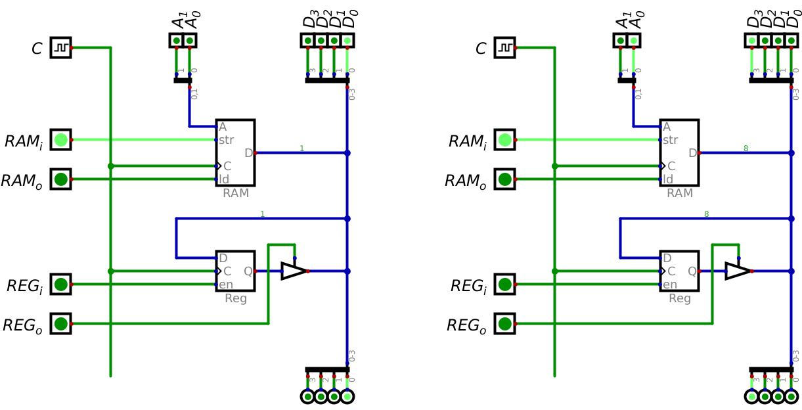
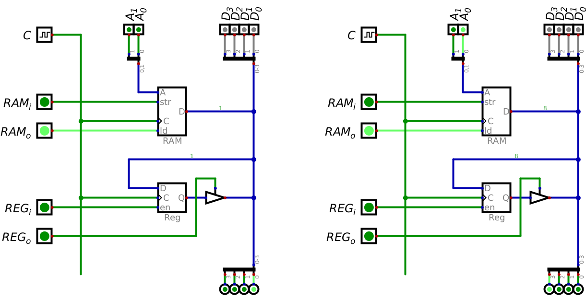

*******
The Bus
*******

* The bus physically connects several components within a computer
* It facilitates the transfer of information between these components, such as RAM and registers

* Typically, there are three types of busses

    * Data bus --- Transfer data between components
    * Address bus --- Transmits memory addresses
    * Control bus --- Sends signals responsible for controlling when components are active

Tri-State Logic
===============

* Tri-state logic was discussed in the previous topic when introducing drivers

    * Drivers were used to control RAM out

* Briefly, components can have three different states

    * Output a high signal by connecting the line to some voltage source (``1``)
    * Output a low signal by connecting the line to ground (``0``)
    * High impedance state/do nothing (``Z``)

* For a shared signal line like a bus, it is important that only one component is outputting a value at a time
* Outputting ``0`` is not the same as outputting nothing since any other signal on the same line would be sunk to ground
* In other words, if two components are connected to the same output line

    * If one component outputs ``0`` by connecting the line to ground
    * And the other outputs ``1`` by connecting the line to a voltage source
    * The line would ultimately have no voltage as it would be connected to ground

* As an analogy, consider a long sink with several faucets and drains connected to it

    A long sink representing some signal line with several components connected. Here, the sink itself represents the
    line and the faucet/drain represents the component's connection to the shared line.

* Here, the sink represents some shared signal line that several components can connect to
* The components' connections to the signal line are represented by the faucets and corresponding drains

* If a components is outputting a signal to the shared line, the faucet will either be on, or the drain will be open

    * When the output is ``1``, the faucet will be on adding water to the sink
    * When the output is ``0``, the drain will be opened, allowing any residual water to drain from the sink

* All other components will be left alone (``Z``), with neither the faucet on or the drains opened
* The presence or absence of water in the sink means that the signal is high or low, respectively

* Consider what would happen in this analogy if one tried to use ``0`` to mean nothing
* If one of the components had their faucets on, but others had their drains open, the water would immediately drain

    * The sink would remain empty

* This would be a problem since the sink *should* have water in it
* This is why it's important to have a third state

Connecting Components
=====================

Loading Data into RAM
=====================

* Consider how one would add data to RAM
* This would require manipulating the signals along the three busses in a specific way

* This is probably best explained with an example
* Add the value ``0001`` to memory address ``00`` and ``1000`` to memory address ``01``
* Below is a table showing how the signals would need to be set to achieve this
* This table however is not a truth table, but instead represents what is effectively a *program*
* In the below table, ``C`` means *clock pulse*, which would happen only after all other signals are set

.. list-table:: Program to add data to RAM
    :widths: auto
    :align: center
    :header-rows: 1

    * - :math:`RM_{i}`
      - :math:`RM_{o}`
      - :math:`RG_{i}`
      - :math:`RG_{o}`
      -
      - :math:`A_{1}`
      - :math:`A_{0}`
      -
      - :math:`D_{3}`
      - :math:`D_{2}`
      - :math:`D_{1}`
      - :math:`D_{0}`
      -
      - :math:`C`
    * - ``1``
      - ``0``
      - ``0``
      - ``0``
      -
      - ``0``
      - ``0``
      -
      - ``0``
      - ``0``
      - ``0``
      - ``1``
      -
      - ``C``
    * - ``1``
      - ``0``
      - ``0``
      - ``0``
      -
      - ``0``
      - ``1``
      -
      - ``1``
      - ``0``
      - ``0``
      - ``0``
      -
      - ``C``

    The left image shows how the signals should be set to add the value ``0001`` to memory address ``00``, and the right
    shows how they should be set to add the value ``1000`` to memory address ``01``. A clock pulse would be required in
    both scenarios to have the data be stored in RAM. These images correspond to the two rows in the above table.

* If one wants to verify that the data did in fact get stored, a different set of signals is needed
* The data stored in RAM would be displayed on the outputs at the end of the data bus
* Be mindful that the data input lines need to be set to ``Z``, otherwise their inputs will interfere with RAM's output
* Clock pulses are not actually needed here, but are included in the table for completeness

.. list-table:: Program to verify that data is in RAM
    :widths: auto
    :align: center
    :header-rows: 1

    * - :math:`RM_{i}`
      - :math:`RM_{o}`
      - :math:`RG_{i}`
      - :math:`RG_{o}`
      -
      - :math:`A_{1}`
      - :math:`A_{0}`
      -
      - :math:`D_{3}`
      - :math:`D_{2}`
      - :math:`D_{1}`
      - :math:`D_{0}`
      -
      - :math:`C`
    * - ``0``
      - ``1``
      - ``0``
      - ``0``
      -
      - ``0``
      - ``0``
      -
      - ``Z``
      - ``Z``
      - ``Z``
      - ``Z``
      -
      - ``C``
    * - ``0``
      - ``1``
      - ``0``
      - ``0``
      -
      - ``0``
      - ``1``
      -
      - ``Z``
      - ``Z``
      - ``Z``
      - ``Z``
      -
      - ``C``

    The left image shows how the signals should be set to verify that the value ``0001`` is stored in memory address
    ``00``, and the right shows how they should be set to verify that the value ``1000`` to memory address ``01``. These
    images correspond to the two rows in the above table. The data stored in RAM at the specified memory addresses is
    displayed on the output at the bottom of the data bus.

Swapping Data
=============

For Next Time
=============

* Read Chapter 2 Section 2 of your text

    * 2 pages