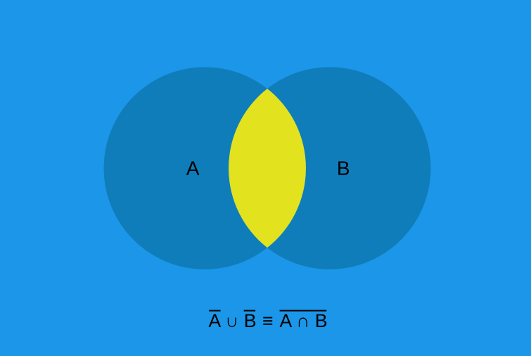
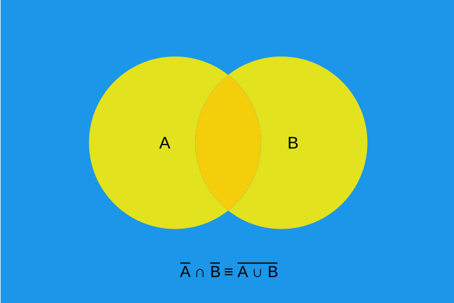

*************
Boolean Logic
*************

* Much of the following will likely be a review of already well understood concepts
* This content is covered for completeness, but will be kept at a relatively high level

Boolean Operators and Operands
==============================

* Boolean logic is a form of algebra that operates on boolean values that can take on only two states
* These states are typically called *true* and *false*

    * Depending on context, these are sometimes referred to as *On*/*Off*, ``1``/``0``, or *high voltage*/*low voltage*

* Within the algebra, the *operands* are values that take on one of these two states
* The *operators* act on these operands to produce a new boolean value

.. note::

    If this terminology is throwing you off, remember that this is like the integer operators/operands you are familiar
    with. Consider the expression :math:`1 + 2`. The operands here are integers :math:`1` and :math:`2` and the operator
    is :math:`+`, which means addition. Here, addition is an operator that takes two integer values and produces a new
    integer value.

* There are three basic boolean operators

    * **Not**

        * Unary operator --- only operates on a single operand to produce a single value
        * Given some boolean value :math:`a`, invert it

            * In other words, if :math:`a` is *true*, not :math:`a` is *false*, and *vice versa*

        * Typically denoted as :math:`\lnot a` or sometimes :math:`\overline a`

    * **And**

        * Binary operator --- operates on two operands to produce a single value
        * Given boolean values :math:`a` and :math:`b`, return *true* if both values are *true*, *false* otherwise
        * Denoted as :math:`a \land b`

    * **Or**

        * Binary operator --- operates on two operands to produce a single value
        * Given boolean values :math:`a` and :math:`b`, return *true* if both or either are *true*, *false* otherwise
        * Denoted as :math:`a \lor b`

* There are additional boolean operators that can be made up from the three basic operators
* Three of these are commonly used within the context of computer architecture, thus they will be presented here

    * **Exclusive Or** (**XOR**)

        * Binary operator --- operates on two operands to produce a single value
        * Given boolean values :math:`a` and :math:`b`, return *true* if and only if either are *true*, *false* otherwise

            * Similar to or, but if both are *true*, it returns *false*

        * Denoted as :math:`a \oplus b`
        * Equivalent to :math:`(a \lor b) \land \lnot (a \land b)`

    * **Not Or** (**NOR**)

        * Literally *not or*
        * Sometimes denoted as :math:`\overline \lor`
        * Equivalent to :math:`\lnot (a \lor b)`
        * Functionally complete --- can be used to generate all other boolean operators

    * **Not And** (**NAND**)

        * Literally *not and*
        * Sometimes denoted as :math:`\overline \land`
        * Equivalent to :math:`\lnot (a \land b)`
        * Functionally complete --- can be used to generate all other boolean operators

Truth Tables
============

Properties of Logical Operators
===============================

De Morgan's Law
---------------

.. warning::

    Although consistently numbered here, the labels of the first and second De Morgan's laws is arbitrary.

* De Morgan's laws are of particular interest in the context of computer architecture

    * Given the popularity of **nor** and **nand** in circuit design

* De Morgan's laws are as follows

        :math:`\lnot a \lor \lnot b = \lnot(a \land b)`

        :math:`\lnot a \land \lnot b = \lnot(a \lor b)`

* Consider that the right hand side of both equations are **nand** and **nor** respectively
* This means that, not only can **nand** be made with **not** and **and**, but also with **not** and **or**

    * One does not even need the **and** operator to create **nand**
    * In fact, given only **not** and **or**, one can create **and**

        * :math:`\lnot(\lnot a \lor \lnot b) = \lnot(\lnot(a \land b)) = a \land b`

    * This would work the same for **nor** being made with **not** and **and**

* The below truth table provides an exhaustive proof of De Morgan's laws

.. list-table:: De Morgan's Laws
    :widths: auto
    :header-rows: 1

    * - :math:`a`
      - :math:`b`
      - :math:`\lnot a`
      - :math:`\lnot b`
      - :math:`a \lor b`
      - :math:`a \land b`
      - :math:`\lnot a \lor \lnot b`
      - :math:`\lnot a \land \lnot b`
      - :math:`\lnot (a \lor b)`
      - :math:`\lnot (a \land b)`
    * - ``0``
      - ``0``
      - ``1``
      - ``1``
      - ``0``
      - ``0``
      - ``1``
      - ``1``
      - ``1``
      - ``1``
    * - ``0``
      - ``1``
      - ``1``
      - ``0``
      - ``1``
      - ``0``
      - ``1``
      - ``0``
      - ``0``
      - ``1``
    * - ``1``
      - ``0``
      - ``0``
      - ``1``
      - ``1``
      - ``0``
      - ``1``
      - ``0``
      - ``0``
      - ``1``
    * - ``1``
      - ``1``
      - ``0``
      - ``0``
      - ``1``
      - ``1``
      - ``0``
      - ``0``
      - ``0``
      - ``0``

* De Morgan's laws may not be immediately obvious, but think about what they *mean*

    * Visualizations may help with grasping the intuition

* Consider the first law

    :math:`\lnot a \lor \lnot b = \lnot(a \land b)`

    Visualization of De Morgan's first law. In this figure, blue is what is included in the result, yellow is what is
    excluded. Here, :math:`\cup` (set union) is equivalent to **or** (:math:`\lor`) and the :math:`\cap` (set intersect)
    is equivalent to **and** (:math:`\land`).

* It is simpler to see how the above figure represents :math:`\lnot(a \land b)`

    * Think of the Venn diagram of **and**, then invert it

* But also imagine what :math:`\lnot a` and :math:`\lnot b` would be

    * :math:`\lnot a` would be everything *but* what is within :math:`a`, including that which is in :math:`b`
    * :math:`\lnot b` would be everything *but* what is within :math:`b`, including that which is in :math:`a`

* It may be helpful to think of two versions of the figure, one which is :math:`\lnot a` and the other :math:`\lnot b`
* Then, **or** would be the *union* of these two images, which is the same as the above figure

    * Union being, keep all points from both images

* Now consider the second law

    :math:`\lnot a \lor \lnot b = \lnot(a \land b)`

    Visualization of De Morgan's second law. In this figure, blue is what is included in the result, yellow is what is
    excluded. Here, :math:`\cup` (set union) is equivalent to **or** (:math:`\lor`) and the :math:`\cap` (set intersect)
    is equivalent to **and** (:math:`\land`).

* Similar to the first law, it is simpler to see how the above figure represents :math:`\lnot(a \lor b)`
* Imagine what :math:`\lnot a` and :math:`\lnot b` would be

    * It's easier to think of two versions of the image, one for each :math:`\lnot a` and :math:`\lnot b`

* Then, **and** would be the *intersect* of these two images, which is the same as the above figure

    * Intersect being, only keep the points that exist in both images

For Next Time
=============

* `Watch Ben Eater's video on how transistors work <https://www.youtube.com/watch?v=DXvAlwMAxiA>`_
* Read Chapter 3 Sections 1 & 2 of your text

    * 7 pages