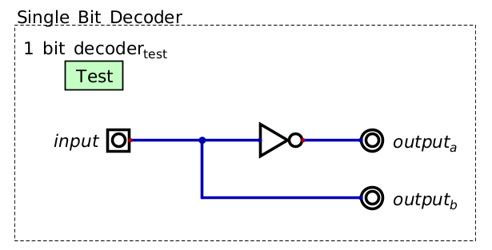

*******************
Combinational Logic
*******************

* With an understanding of logic gates, more complex logic structures can be constructed
* Here, structures that can make decisions based on some combination of inputs will be explored

Decoders
========

* Consider a situation where an input signal controls two outputs, where only one should be active at a time

    * When the input signal is low, one of the two outputs is high
    * When the input signal is high, the other output should be high

.. list-table:: Single Bit Decoder
    :widths: auto
    :align: center
    :header-rows: 1

    * - Input
      -
      - Output a
      - Output b
    * - ``0``
      -
      - ``1``
      - ``0``
    * - ``1``
      -
      - ``0``
      - ``1``

.. note::

    Until now, all truth tables were shown to demonstrate how the boolean operators worked, each taking some number of
    inputs and producing a single output. These truth tables were used to describe how each operator worked.

    Here, the truth table is not describing any specific operator, but some desired functionality. The goal would then
    be to construct some circuit with logic gates to produce the desired functionality.  Further, it's showing how the
    desired functionality has more than one output. More specifically, when the input is ``0``, output a should be ``0``
    and output b should be ``1``, and when the input is ``1``, output a should be ``1`` and output b should be ``0``.

* Based on the truth table, how could this functionality be achieved with boolean operators?

    * Output a is the inversion of the input
    * Output b is simply the input

    A single bit decoder. At any point in time, a single output is always high. The specific output that is high is
    controlled by the input signal.

* This is an example of a single bit decoder

    * The one input signal can be thought of as a single bit
    * The input signal is "decoded" to control the output signals

More than One Input Bit
-----------------------

* Now consider a situation where four outputs need to be controlled
* A single input can only have one of two states, low/high

    * Thus, more than one input signals would be needed to decode to four outputs

* Two input signals can have a total of four unique states

    * Two inputs are sufficient to decode to four output signals

.. list-table:: Two Bit Decoder
    :widths: auto
    :align: center
    :header-rows: 1

    * - Input a
      - Input b
      -
      - Output 0
      - Output 1
      - Output 2
      - Output 3
    * - ``0``
      - ``0``
      -
      - ``1``
      - ``0``
      - ``0``
      - ``0``
    * - ``0``
      - ``1``
      -
      - ``0``
      - ``1``
      - ``0``
      - ``0``
    * - ``1``
      - ``0``
      -
      - ``0``
      - ``0``
      - ``1``
      - ``0``
    * - ``1``
      - ``1``
      -
      - ``0``
      - ``0``
      - ``0``
      - ``1``

* The trick to creating a decoder with more than one bit is to use and gates with specific inputs inverted

    * Create an and gate for all patterns of inverted inputs
    * This idea works well for any case where a specific input patten should result in an output signal being high

    A two bit decoder. Two input signals are decoded to control a the four putput signals. At any time, only one of the
    four output signals is high.

* This particular design scales such that one can create decoders of any size

    * The only constraint, for lack of a better term, is the relationship between inputs and outputs
    * Given :math:`n` inputs, a total of :math:`2^{n}` outputs can be controlled

* One may have noticed the pattern in the two bit decoder truth table
* Interestingly, if thinking of the two inputs as a binary number, the binary number corresponds to which output high

    * Consider "output x" to be the Xth output, in the decimal number system

        * :math:`00_{2} = 0_{10}` --- when the pattern is ``00``, output 0 is high
        * :math:`01_{2} = 1_{10}` --- when then pattern is ``01``, output 1 is high
        * :math:`10_{2} = 2_{10}` --- when then pattern is ``10``, output 2 is high
        * :math:`11_{2} = 3_{10}` --- when then pattern is ``11``, output 3 is high

Multiplexers
============

Programmable Logic Arrays
=========================

Functional Completeness
=======================

For Next Time
=============

* Read Chapter 3 Sections 4 & 5 of your text

    * 4 pages