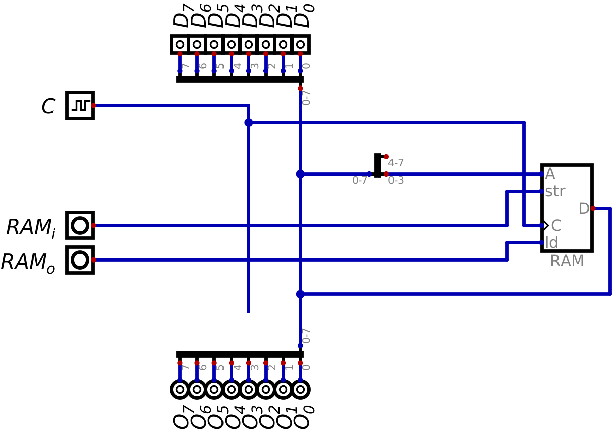
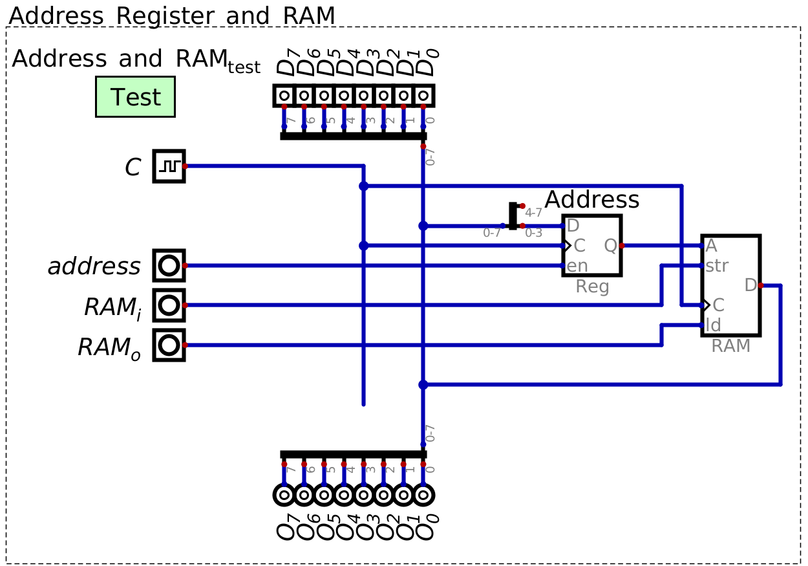

************************
Address Register and RAM
************************

* RAM stores data and instructions for the computer
* The values in RAM are temporary

    * RAM is not designed for long term storage
    * It is designed to store values the computer is working with  

* Although RAM was discussed in earlier topics, it is time to incorporate it into the ESAP system design

RAM Module
==========

Address Register
----------------

* Having the memory addresses and data share a bus poses a problem for the system

    * The vales on the bus are always changing, but the indexed memory location may need to be static for some time

    A not particularly useful configuration of A RAM component with a shared address and data bus.

* Consider the above configuration of RAM in a system with a shard address and data bus

    * Mind the splitter used
    * Remember, only 4 bits are used to index memory
    * Thus, only the 4 least significant bits are useful for indexing RAM
    * The 4 most significant bits are ignored

* Is it possible, for example, to store the value 4 in memory address 2?

    * It's possible to index memory address 2 by configuring the data on the bus to ``0b00000010``
    * But as soon as the value 4 is added to the bus (``0b00000100``), memory address 4 is indexed, not 2

* The problem is, the memory address indexed in RAM will always be based on what value is currently on the bus
* Therefore, there needs to be a way to isolate the memory address from the value on the data bus

* A simple solution to this problem is to add an address register

    * Input the memory address to index into the address register
    * This value will be unchanged until explicitly updated
    * The address value stored in the address register will be what is indexing RAM
    * Now the data on the bus can change without impacting the memory address being indexed

    A configuration of RAM component with an address register facilitating the separation of a memory address and the
    changing values stored on the bus.

* With this configuration, there is now a small, but isolated address bus

    * The line connecting the output of the address register and the RAM component's address input
    * Between the register's :math:`Q` and RAM's :math:`A`

* To return to the previous example problem, it is now possible to load the value 4 into memory address 2

    #. Configure the data on the bus to be 2 (``0b00000010``)
    #. Load the value from the bus into the address register with the :math:`address` control signal
    #. Configure the data on the bus to be 4 (``0b00000100``)
    #. Load the value from the bus into RAM with the :math:`RAM_{i}` control signal

Including RAM in the System
===========================

Executing Arithmetic on the ALU with RAM
========================================

For Next Time
=============

* Something?

