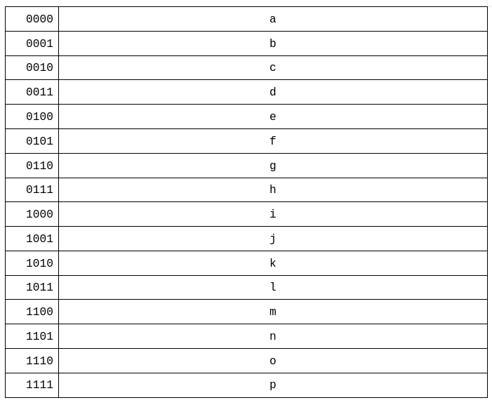

************************
Address Register and RAM
************************

* RAM stores data and instructions for the computer
* The values in RAM are temporary

    * RAM is not designed for long term storage
    * It is designed to store values the computer is working with  

* Although RAM was discussed in earlier topics, it is time to incorporate it into the ESAP system design

RAM Module
==========

* As previously discussed, memory stores data in individually indexable memory addresses
* The number of unique memory addresses is called the address space
* Each location stores some amount of data, called the addressability
* The amount of data in memory address is independent from the number of memory addresses

* Most computers are byte addressable, meaning each memory address stores one byte of data

    * This is not a requirement, however

* The total amount of data storable is the size of the address space times the addressability

    Visualization of RAM. The left column is memory addresses, and the right is the data stored at the respective memory
    address.

* In the above example, a total of 16 unique memory addresses exist

    * Each address is represented as a row in the table
    * The memory address is included in the left column of the table

* This means, in this example, there is an address space of 16

    * Locations ``0b0000`` -- ``0b1111``
    * Or, ``0x0`` -- ``0xF``

* With an address space of 16, a total of four bits would be required to index each memory address

* The data stored in each of the 16 memory address is represented as the 16 letters

    * The letters ``a`` -- ``p``, one in each row
    * In the image, the addressability is not represented; one cannot determine the amount of data in each location

We have a shared data and address bus
Although we have an 8 bit bus,
Due to the limitations of the system, we will only have 4 address lines
    will be clear later

16 possible addresses

4 bits can be moved on the bus to address RAM
each memory location will store 8 bits of data, that can be moved around by the bus
most computers are byte addressable

.. note::

    Until the late 2000s/early 2010s, a typical computer used a 32 bit processor. One of the limitations of such a
    system is the address space --- 32 bits could index :math:`2^{32}`, or :math:`4,294,967,296` unique memory
    addresses. This may feel like a lot, but to put this into perspective, that's only :math:`4GB`.

Address Register
----------------

Including RAM in the System
===========================

Executing Arithmetic on the ALU with RAM
========================================

For Next Time
=============

* Something?

