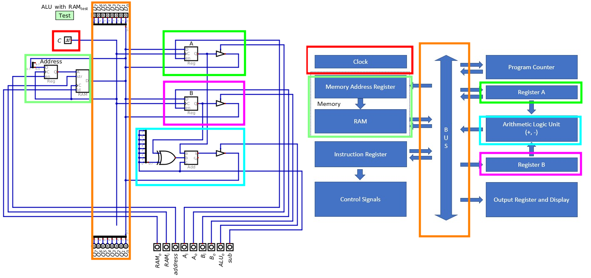

************************
Address Register and RAM
************************

* RAM stores data and instructions for the computer
* The values in RAM are temporary

    * RAM is not designed for long term storage
    * It is designed to store values the computer is working with  

* Although RAM was discussed in earlier topics, it is time to incorporate it into the ESAP system design

RAM Module
==========

Address Register
----------------

Including RAM in the System
===========================

* Adding the RAM module to the system is trivial

    * Connect the corresponding components up to the existing ESAP ALU system
    * Each of the control signal lines are moved to the bottom of the system

    Configuration of the ESAP ALU with RAM added to the system.

* Notice that the RAM module was added to the left hand side of the data bus

    * This is a design/style decision; it is not important that it is placed here

* Motivation for putting it on the left is

    * It will correspond to the ESAP system architecture overview already discussed
    * The image would get too long/tall if every component/module was stacked on the right hand side of the bus

    Comparison of the ALU with RAM and the ESAP architecture overview.

Executing Arithmetic on the ALU with RAM
----------------------------------------

For Next Time
=============

* Something?

