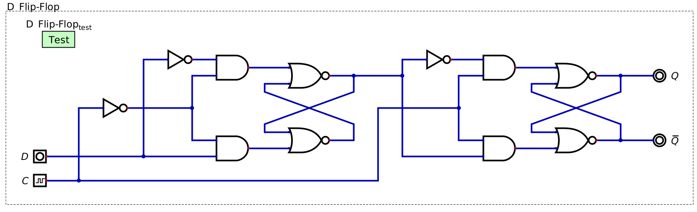

**********************
Latches and Flip-Flops
**********************

* The combinational logic topic covered circuits that did not store or require any stored data to operate
* Here, circuits capable of storing data for later use will be covered
* These can later be used to construct more complex circuits that make decisions based on a series of possible states

Set-Reset Latch (S-R Latch)
===========================

* One of the most basic circuits for storing data is a set-reset latch (S-R latch)
* What's unusual about this circuit is that it has internal feedback

    * The output of the circuit is fed back into itself as input

    An S-R latch using NOR gates. The :math:`S` means "set", :math:`R` is "reset", :math:`Q` is the bit being stored,
    and :math:`\lnot Q` is the inverse of the bit being stored. Notice how the outputs of the circuit (:math:`Q` and
    :math:`\lnot Q`) also serve as two of the four inputs to the circuit.

.. note::

    There are several possible designs for an S-R latch. The textbook uses a similar design to the above image, but
    uses two NANDs instead of NORs. Although this NAND based design would work slightly differently, the general idea 
    is the same.

* In an S-R Latch

    * :math:`S` stands for "set" --- set the stored bit to ``1``
    * :math:`R` stands for  "reset" --- clear the stored bit and set it to ``0``
    * :math:`Q` is the value of the bit being stored
    * :math:`\lnot Q` is the inverse of the bit being stored

* Since this circuit has internal feedback, it's behaviour depends on the current state

    * The way it behaves when changing :math:`S` or :math:`R` depends on the current output

.. list-table:: Truth Table for S-R Latch
    :widths: auto
    :align: center
    :header-rows: 1

    * - :math:`S`
      - :math:`R`
      -
      - :math:`Q`
      - :math:`\lnot Q`
      -
      - :math:`Q'`
      - :math:`\lnot Q'`
    * - ``0``
      - ``0``
      -
      - ``0``
      - ``1``
      -
      - ``0``
      - ``1``
    * - ``0``
      - ``0``
      -
      - ``1``
      - ``0``
      -
      - ``1``
      - ``0``
    * - ``1``
      - ``0``
      -
      - ``0``
      - ``1``
      -
      - ``1*``
      - ``0*``
    * - ``1``
      - ``0``
      -
      - ``1``
      - ``0``
      -
      - ``1``
      - ``0``

    * - ``0``
      - ``1``
      -
      - ``0``
      - ``1``
      -
      - ``0``
      - ``1``
    * - ``0``
      - ``1``
      -
      - ``1``
      - ``0``
      -
      - ``0**``
      - ``1**``
    * - ``1``
      - ``1``
      -
      - ``0``
      - ``1``
      -
      - ``0``
      - ``0``
    * - ``1``
      - ``0``
      -
      - ``1``
      - ``0``
      -
      - ``0``
      - ``0``

* In the above table

    * :math:`Q/\lnot Q` designate the state before changing :math:`S/R`
    * :math:`Q'/\lnot Q'` designate the state after changing :math:`S/R`
    * Also note that :math:`Q/\lnot Q` should never be equal

* When :math:`S` and :math:`R` are both ``0``, the output state of the circuit will not change

    * The values of :math:`Q` and :math:`\lnot Q`, whatever they are, will not change
    * This is called the *quiet state*, or *quiescent state*

* When :math:`S` is set high, one of two things can happen

    * The circuit may be in a *stable state*, meaning the outputs do not change

        * This will happen when the output of :math:`Q` is already ``1``

    * Alternatively, the circuit may be put into an *unstable state*, meaning the values of the output change

        * The outputs of this state are emphasized within the above truth table with ``*``
        * This happens when the output of :math:`Q` is ``0``
        * This will cause :math:`Q` to become ``1``
        * This then causes the output of :math:`\lnot Q` to also change, putting the circuit into a stable state
        * In practice, the unstable state will be resolved nearly instantaneously --- on the order of nanoseconds

* When :math:`R` is set high, like with setting :math:`S` high, one of two things can happen

    * The circuit may be in a *stable state*, meaning the outputs do not change
    * The circuit may be put into an *unstable state*, meaning the values change

        * The outputs of this state are emphasized within the above truth table with ``**``

* Finally, if both :math:`S` and :math:`R` are high, the outputs are both ``0``, but this is an invalid state

    * It's not reasonable to set and reset at the same time
    * Further, having both :math:`Q` and :math:`\lnot Q` equal is inadmissible
    * One *could* do it, but there is no real utility in doing so

.. admonition:: Activity

    When the circuit turns on for the first time and all inputs are ``0``, what will the outputs of :math:`Q` and
    :math:`\lnot Q` be?

Data Latch (D Latch)
====================

* The S-R latch can be modified to eliminate the ability for both set and reset to be high at the same time

    * Make it such that only one can be active at a time

* This can be achieved by having a single input split into two signals

    * One of the two parts of the split signal is fed into the S-R latch
    * The other part is inverted before being fed into the S-R latch

    A D latch, which is a modified S-R latch. Here, :math:`D` is the label for the input data. Like the S-R latch,
    :math:`Q` is the bit being stored, and :math:`\lnot Q` is the inverse of the bit being stored. The labels
    :math:`S` and :math:`R` are included here as a reference to what these inputs were called in the S-R latch, but
    are not typically included in diagrams of D latches.

* The above figure shows how the S-R latch may be modified into what is called a Data latch (D latch)

    * The :math:`D` means data

* With this configuration, it's not possible to have the :math:`S` and :math:`R` both be high at the same time

    * Or at least, the inputs that were :math:`S` and :math:`R` in the S-R latch

* Unfortunately, however, it's also not possible to have :math:`S` and :math:`R` both be low at the same time
* This eliminates the quiet state, which was necessary for storing, or *latching*, the bit

    * When :math:`D` is ``1``, :math:`Q` is ``1``
    * When :math:`D` is ``0``, :math:`Q` is ``0``

* This D latch design effectively only relays the input to the output with no way to save data

D Latch with Enable
-------------------

D Flip-Flop
===========

* A clock is a device within computers used to synchronize most of the components performing operations
* It produces a periodic waveform at a constant frequency, jumping from low to high to low, etc.

    Example clock signal. This signal has a constant frequency and oscillates between a low and high signal.

* Typically, one would want to synchronize when data is stored with the clock cycles
* However, the D latch with enable will change the value stored whenever the clock enable is high
* For practical reasons, the data should only be latched the instant the clock pulses

* One solution to this problem is to combine two D latches in series, but carefully control when each D latch is enabled

    A D flip-flop made by combining two D latches. The enable is labelled :math:`C` for clock and controls when each
    D latch is enabled. Notice how the clock's enable line is inverted into the first D latch, meaning it's not possible
    for both D latches to be active at once.

C is clock, which is serving as enable
Notice how one of the clock enables is inverted before attached
Only one can be in quiet state at a time

When clock is low, first d latch will store whatever is on D input

    * Can toggle a bunch, doesn't matter, whatever is there is stored
    * Second D latch is in quiet state, nothing changes

When clock goes high, the first D latch goes to a quiet state
    Second latch goes active, and whatever is stored in first D latch moves to second
    the value output by first D latch moves to second D latch

When clock goes high, there is no direct way to modify the second d latches' data input as it comes from a quiet d latch

For Next Time
=============

* Check out the :download:`S-R Latch <SR_latch.dig>` schematic for Digital
* Read Chapter 3 Section 6 of your text

    * 14 pages