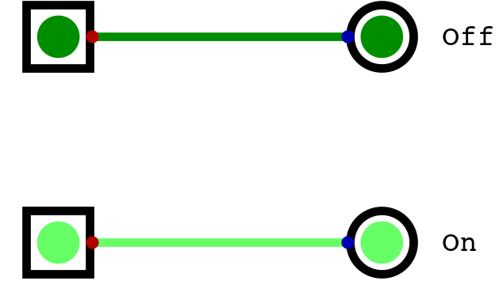

******
Memory
******

* Until now, all circuits discussed made no use of stored information
* However, storing data for later use is an important function of a typical digital computer
* Memory can be used to store

    * Data, such as the value of a variable
    * Instructions, such as a program

Bits, Bytes, and Data
=====================

* Before getting into the details of memory, it's important to be clear on what data and information is

    * Data is some collection of raw values/symbols that have no intrinsic meaning on their own

        * For example, the number :math:`3` is data

    * Information is data that has meaning within some context

        * :math:`3` is information on a quantity in the context of the question of how many dogs are in a car

* A *bit* is the most basic unit of data in typical computing
* As already discussed, a bit is a single digit in base two
* However, a bit is represented within computers as a single signal
* These bits/signals can take on two possible states ``0`` or ``1``
* This means that, with one bit, a total of two unique values can be represented

    Single bit shown twice with the two possible states it can take --- off and on.

- A byte
- how many unique values
- what those values mean depends on the encoding/decoding

- 32 bits (4 bytes)
- 64 bits 8 bytes

Address Space
=============

Addressability
==============

256 Byte Memory Example
=======================

For Next Time
=============

* `Watch Ben Eater's video on S-R Latches <https://www.youtube.com/watch?v=KM0DdEaY5sY>`_
* `Watch Ben Eater's video on D Latches <https://www.youtube.com/watch?v=peCh_859q7Q>`_
* `Watch Ben Eater's video on D Flip-Flops <https://www.youtube.com/watch?v=YW-_GkUguMM>`_
* Read Chapter 3 Sections 4 of your text

    * 3 pages