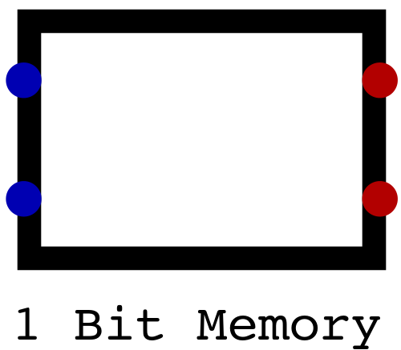
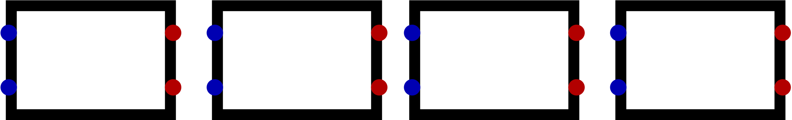
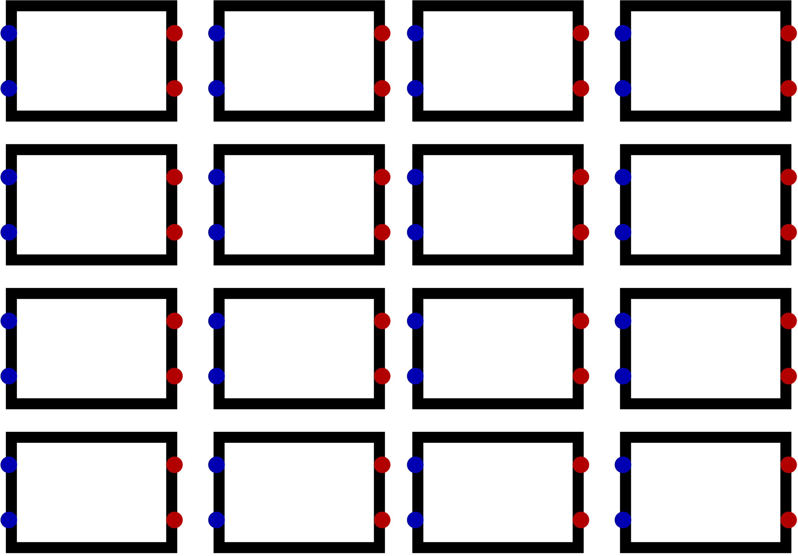
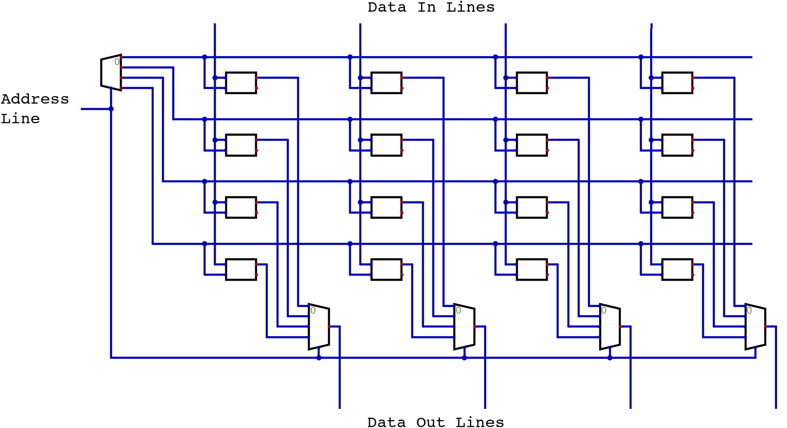

******
Memory
******

* Storing data for later use is an important function of a typical digital computer
* Memory can be used to store

    * Data, such as the value of a variable
    * Instructions, such as a program

Bits and Bytes
==============

Address Space
=============

Addressability
==============

4x4 Bit Memory Example
======================

* Imagine there exists some way to store a single bit of data
* For now, this one bit storage component will be represented as a box

    A box representing some component capable of storing a single bit of data.

* If one wanted to store more bits, they could group multiple one bit storage components together

    Four boxes, each representing a component capable of storing one bit of data. Together, these four boxes are able to
    store four bits of information.

* If one now wants the ability to store several groups of many bits, they could stack sets of these components together

    Four groups of four boxes. One can think of this as a block of memory with four memory addresses, each storing four
    bits of data. Each row represents a memory address, and each column represents a bit within that memory address.

* Consider a 4x4 block of RAM

    * Four bits per memory address
    * Four memory addresses

* Using the above image for reference, one can think of the 4x4 block of memory as

    * Four rows, each representing a unique memory address
    * Four columns, each representing a bit within that memory address

* For this RAM to be useful, one needs a way to

    * Write data to a specific memory address
    * Read data from a specific memory address

* With this 4x4 block of RAM

    * Two address lines would be required to uniquely identify each memory location
    * Four data lines would be required to input data
    * Four data lines would be required to output data

* Fortunately, decoders and multiplexers provide a way to specify memory addresses to write and read from

    * If writing, a memory address can be activated by feeding the address lines into a decoder
    * If reading, a multiplexer can be used to output each bit's data, whatever it is, at a specific memory address

    Visualization of a 4x4 block of RAM. Here, address lines are decoded to select a memory address (row) for writing
    data from the data input lines. Bits from all memory addresses (column) are mapped to a multiplexer that will output
    the value stored at the specified memory address to the data output lines.

* The question remains --- how does one actually store data?

For Next Time
=============

* `Watch Ben Eater's video on S-R Latches <https://www.youtube.com/watch?v=KM0DdEaY5sY>`_
* `Watch Ben Eater's video on D Latches <https://www.youtube.com/watch?v=peCh_859q7Q>`_
* `Watch Ben Eater's video on D Flip-Flops <https://www.youtube.com/watch?v=YW-_GkUguMM>`_
* Read Chapter 3 Sections 4 of your text

    * 3 pages