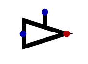
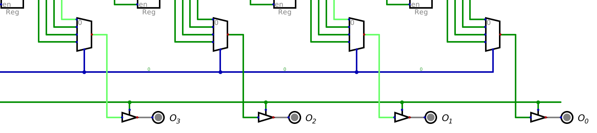

*****************
Registers and RAM
*****************

Registers
=========

Storing a Byte
--------------

Random Access Memory
====================

Controlling Writes
------------------

Controlling Reads
-----------------

* Similar to the decoder, multiplexers will always be outputting the selected signal
* However, it is desirable to have control over when a signal is being read/output from RAM

* Here, a problem arises
* Typically, several computer components share a collection of signal lines to transfer data
* This shared collection of signal lines is called the *bus*

    * The bus will be discussed in more detail in the subsequent topic

* Therefore, it is important that only specific components are reading/writing form the bus at a time

    * Otherwise, the signals on the bus could become corrupted and lose meaning

* The trouble here is, when a component is outputting a low signal, it isn't simply outputting nothing
* Instead, the component connects the signal line to ground, thereby sinking the signal

    * Trying to put any data on a signal line that is sunk to ground would result in it also being sunk to ground

* In other words, there needs to be a way to output a ``0``, a ``1``, and to output *nothing*
* This is where a *driver* comes in

    A driver component capable of allowing a signal to pass only when the control signal is high. When enabled, the
    input signal is relayed to the output. When enable is low, the driver's output signal is in a high impedance
    state, meaning there is effectively no output.

* A driver is a component that can act as a switch
* When the driver is active, it relays, or *drives*, the input signal to the output
* When it is not active, it is in a "high impedance", or "high-Z" state

    * This effectively means the driver outputs nothing

* This facilitates tri-state logic

    * ``0``
    * ``1``
    * ``Z`` (nothing)

* Therefore, drivers are an ideal tool for controlling when RAM is being read from

    Drivers controlling when data is being read from RAM. Here, despite the data being read from RAM being ``1010``, as
    seen by the multiplexer signal lines, the :math:`EN_{r}` signal is low, meaning the drivers are in a high impedance
    state, thereby effectively outputting nothing.

For Next Time
=============

* Check out the :download:`1 bit register <1_bit_register.dig>` schematic for Digital
* Check out the :download:`1 byte register <8_bit_register.dig>` schematic for Digital
* Check out the :download:`RAM <4x4_ram.dig>` schematic for Digital
* Read Chapter 3 Section 6 of your text

    * 14 pages