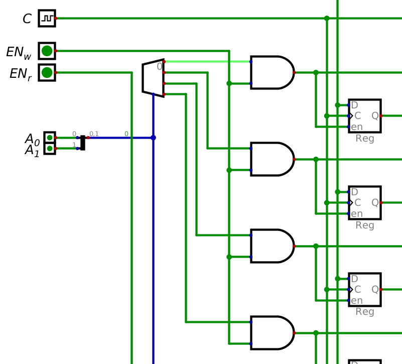

*****************
Registers and RAM
*****************

Registers
=========

Storing a Byte
--------------

Random Access Memory
====================

Controlling Writes
------------------

* When using a decoder to select a memory address, one of the decoded signals is always going to be high
* This creates a problem as one of the memory addresses would be written to every clock pulse, even if not intended
* Thus, there needs to be a way to have more control over when data is written to a memory address

* One possible way to address this problem is to have a write enable signal toggle if clock pulses reach the registers

    * This *can* work, but as discussed above, it may create problems in practice
    * In general, it is best to not manipulate the clock signal

* An alternative is to have a write enable signal control if the decoded signals are active or not
* This can be achieved by ANDing an enable signal with each decoded signal
* Below is a figure showing the relevant portion of the 4x4 block of RAM

    Controlling writes with a write enable signal. Here, the memory address selected is ``00``, which means the
    corresponding decoded signal (top) after the decoder is active. However, since :math:`EN_{w}` is low, the decoded
    signal can not reach the registers at memory address ``00``.

Controlling Reads
-----------------

For Next Time
=============

* Check out the :download:`1 bit register <1_bit_register.dig>` schematic for Digital
* Check out the :download:`1 byte register <8_bit_register.dig>` schematic for Digital
* Check out the :download:`RAM <4x4_ram.dig>` schematic for Digital
* Read Chapter 3 Section 6 of your text

    * 14 pages