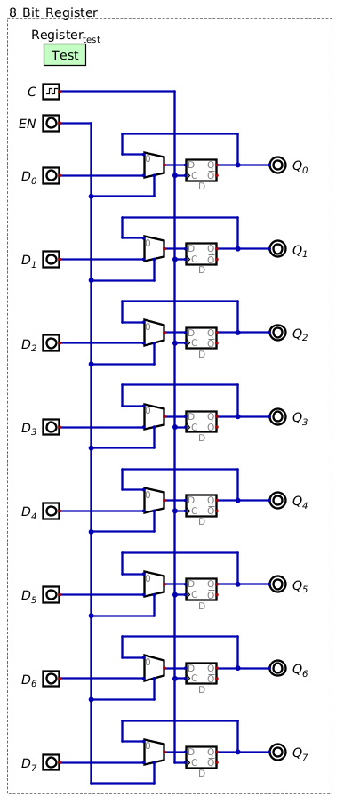
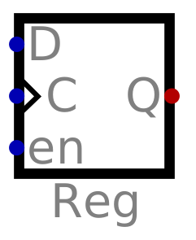
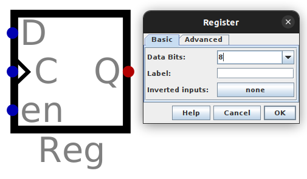

*****************
Registers and RAM
*****************

Registers
=========

Storing More than a Bit
-----------------------

* A D flip-flop with enable can act as a register to effectively store a single bit of information
* To store more than a single bit, configure multiple registers in parallel
* For example, to store 8 bits/1 byte of data, stack eight registers together

    Eight D flip-flops with enables (registers) configured in parallel such that they can store eight bits/one byte of
    information. A single :math:`EN` signal controls when all bits are stored in the register.

* The design shown above can scale such that an arbitrary number of bits can be stored

Register Symbol
---------------

* Many components are represented as a box

    * For example, D flip-flops and registers are both represented as boxes

* However, these components are differentiated by their input labels and sometimes a label
* In Digital, registers are represented with the following symbol

    The symbol of a register within Digital.

* In the above figure, notice how the :math:`\lnot Q` output is not included
* Typically, for registers, this output is not included

    * If one truly needs it, invert the :math:`Q` output

* Digital also allows the user to edit a register component to store a specified number of bits

    * If more than one bit is to be stored, the data lines would need to be combined with a merger component

    A register component within Digital capable of storing 8 bits of data.

Random Access Memory
====================

Controlling Writes
------------------

Controlling Reads
-----------------

For Next Time
=============

* Check out the :download:`1 bit register <1_bit_register.dig>` schematic for Digital
* Check out the :download:`1 byte register <8_bit_register.dig>` schematic for Digital
* Check out the :download:`RAM <4x4_ram.dig>` schematic for Digital
* Read Chapter 3 Section 6 of your text

    * 14 pages