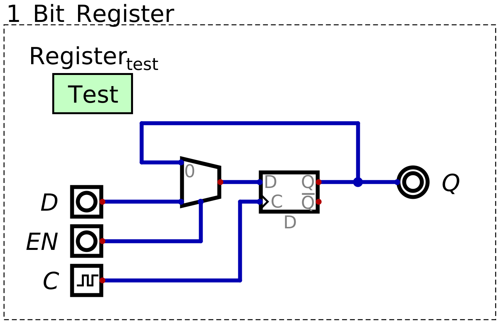

*****************
Registers and RAM
*****************

* D flip-flops allow one to store a single bit of information
* However, they always updates what's stored on every clock pulse
* In many cases, one wants more control over *when* the stored data in the D flip-flop is updated

Registers
=========

.. figure:: D_flip_flop.png
    :width: 666 px
    :align: center

    D flip-flops always update the data being stored/latched whenever the clock pulses. If the data line is low, then
    the D flip-flop will store a ``0`` on a clock pulse, if the data line is high, then a ``1`` is stored on a clock
    pulse.

* D flip-flops have several uses, but they always update the stored value every time the clock pulses
* However, for general purpose memory, the goal is to leave the stored data alone for several clock cycles
* In other words, there needs to be a way to toggle when the signal on the data line is to be stored on a clock pulse

* One way this can be achieved is to still update the stored value on every clock pulse
* However, it will update to either

    * The value on the data line
    * The value that is already stored

* This means there will effectively be two data lines

    * The actual data line
    * A feedback line from the D flip-flop's output

* Then, all that is needed is some control structure to toggle between which of the two data lines need to be read form

    A D flip-flop with enable, which can be used as a register. When the :math:`EN` signal is low, the value of
    :math:`Q` will be fed back into the D flip-flop, which will be re-latched on a clock pulse, leaving the value stored
    effectively unchanged. When :math:`EN` is high, the value from the :math:`D` line will be latched on a clock pulse.  

* EXPLAIN

IMAGES

* This type of structure, with the D flip-flop, is called a *register*

Storing a Byte
--------------

Random Access Memory
====================

Controlling Writes
------------------

Controlling Reads
-----------------

For Next Time
=============

* Check out the :download:`1 bit register <1_bit_register.dig>` schematic for Digital
* Check out the :download:`1 byte register <8_bit_register.dig>` schematic for Digital
* Check out the :download:`RAM <4x4_ram.dig>` schematic for Digital
* Read Chapter 3 Section 6 of your text

    * 14 pages