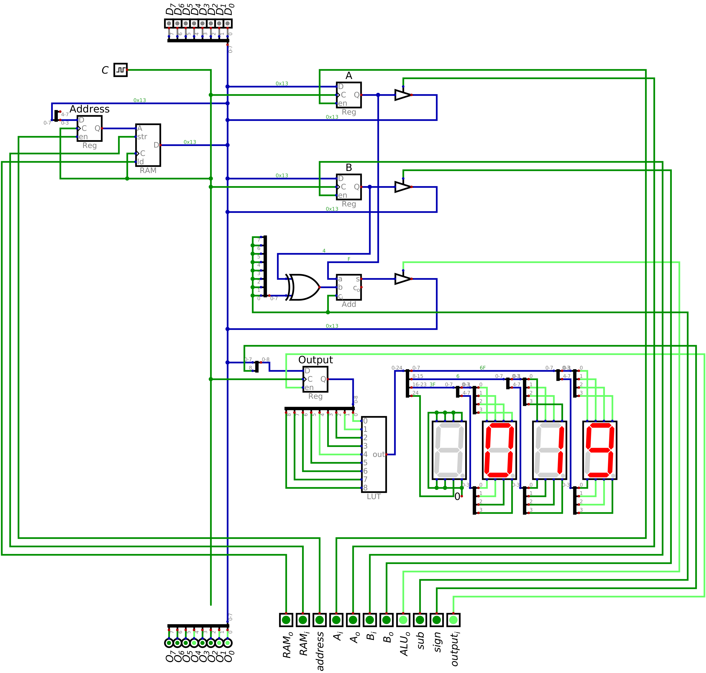

===============
Output Register
===============

* The look up tables provides a simple way to convert binary numbers to their seven segment display patterns
* Now, a register will be incorporated into the design to provide control over which data is being output to the display

Output Module
=============

Including Output in the System
==============================

Example of Outputting from the System
=====================================

following same as before adding two numbers
keep it simple though

    Load data straight to registers
    output addition

    load to ram
    put into regs
    get addition
    output addition to output

The below table is the program

    Address register and RAM in/out are excluded for space

.. list-table:: Add 15 and 4, and output the result
    :widths: auto
    :align: center
    :header-rows: 1

    * - :math:`A`
      - :math:`B`
      - :math:`ALU_{o}`
      - :math:`sub`
      - :math:`out_{i}`
      - :math:`sign`
      -
      - :math:`D`
      -
      - :math:`C`
    * - ``1/0``
      - ``0/0``
      - ``0``
      - ``0``
      - ``0``
      - ``0``
      -
      - ``0x0F``
      -
      - ``C``
    * - ``0/0``
      - ``1/0``
      - ``0``
      - ``0``
      - ``0``
      - ``0``
      -
      - ``0x04``
      -
      - ``C``
    * - ``0/0``
      - ``0/0``
      - ``1``
      - ``0``
      - ``1``
      - ``0``
      -
      - ``Z``
      -
      - ``C``

* The below image shows the state of the system after adding 15 and 4 together and outputting the result
* Due to the output register, the computer could continue to operate while still outputting this value
* In other words, the control signals could change, along with the data on the bus, and the output would remain

    * Unless new data was put into the output register

    ESAP system outputting 19 on the seven segment displays. This would be the final state of the system after executing
    the program described in the above table.

For Next Time
=============

* Something?

