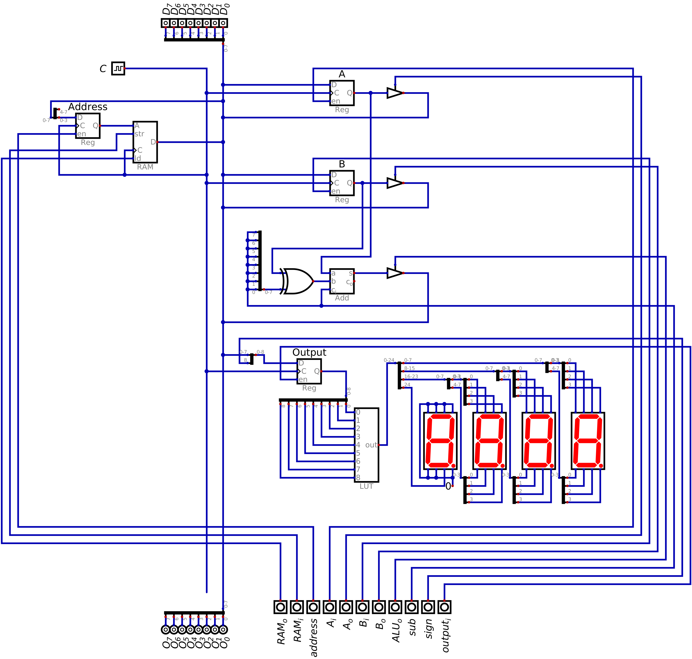

===============
Output Register
===============

* The look up tables provides a simple way to convert binary numbers to their seven segment display patterns
* Now, a register will be incorporated into the design to provide control over which data is being output to the display

Output Module
=============

Including Output in the System
==============================

* Adding the output module to the ESAP system is an exercise in connecting the corresponding components

    * Like when adding the RAM module to the system

    Configuration of the ESAP system with the ALU, RAM, and output modules connected.

* Like before, the control signals are moved to the bottom of the design to keep them together
* The placement of the output register in the ESAP system is not important, but does match the architecture overview

    Comparison of the current system and the ESAP architecture overview.

Example of Outputting from the System
=====================================

For Next Time
=============

* Something?

