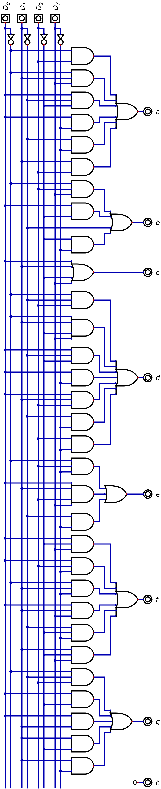
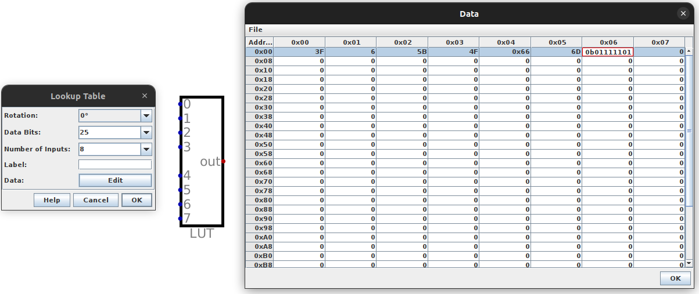

**********************
Seven Segment Displays
**********************

* Binary values from the data bus have been readable through Digital's output components
* However, base 10 is preferable when viewing numbers
* Further, the data on the bus is always changing

    * Sometimes output should persist
    * Not all data on the bus needs to be output

* An output register will be used to improve system outputs
* Seven segment displays will be used as the mechanism for displaying base 10 numbers

.. figure:: real_seven_segment_display.png
    :width: 250 px
    :align: center
    :target: https://en.wikipedia.org/wiki/Seven-segment_display

    A common seven segment LED display. By turning different segments of the display on/off, different values can be
    visually represented.

Seven Segment Display
=====================

Binary Numbers to Decimal for a Seven Segment Displays
======================================================

Programmable Logic Arrays and Look Up Tables
--------------------------------------------

* As discussed earlier in the semester, *Programmable Logic Arrays* (PLAs) can be used to create any logical mapping

    * Can map any binary input to a binary output

* Thus, they are ideal for mapping the system's binary numbers to their seven segment display patterns
* Unfortunately, however, they scale very poorly with input size and become very difficult to work with

    * They scale exponentially

* Below is an example of a PLA mapping four bits to only the least significant digit's seven segment display pattern

    * Two digits would be required to display all possible 4 bit integers
    * For simplicity (and sanity), only the one digit was included

    Programmable logic array mapping a 4 bit binary number to a seven segment display pattern for only the least
    significant digit.

* A PLA for all three output bits for an 8 bit number would be markedly larger and much more difficult to work with
* Fortunately, as discussed earlier in the semester, *Look Up Tables* (LUT) can be used to simplify such functionality
* In fact, one can edit the LUT easily to enter bit patterns by hand

    Editing a Look Up Table within Digital

* A LUTs contents can be saved to a file, which would produce something like below

    * Note that the values here are in hexadecimal, not binary
    * Further, this is far from complete for the 8 bit, 3 digit display

    .. code:: text

        v2.0 raw
        3f
        6
        5b
        4f
        66
        6d
        7d

* Treating the LUT as a map/dictionary, the key is the row number, and the value is the contents of that row

    * In the above example, the "key" 3 maps to the "value" ``4f``
    * The 3rd row (starting at 0) contains ``4f``

* To make things even easier, one can even import a hex file to the LUT

    * This way, there is no need to enter all 256 patterns by hand
    * Instead, the hex file can be generated programmatically

Creating Seven Segment Display Patterns
=======================================

For Next Time
=============

* Something?