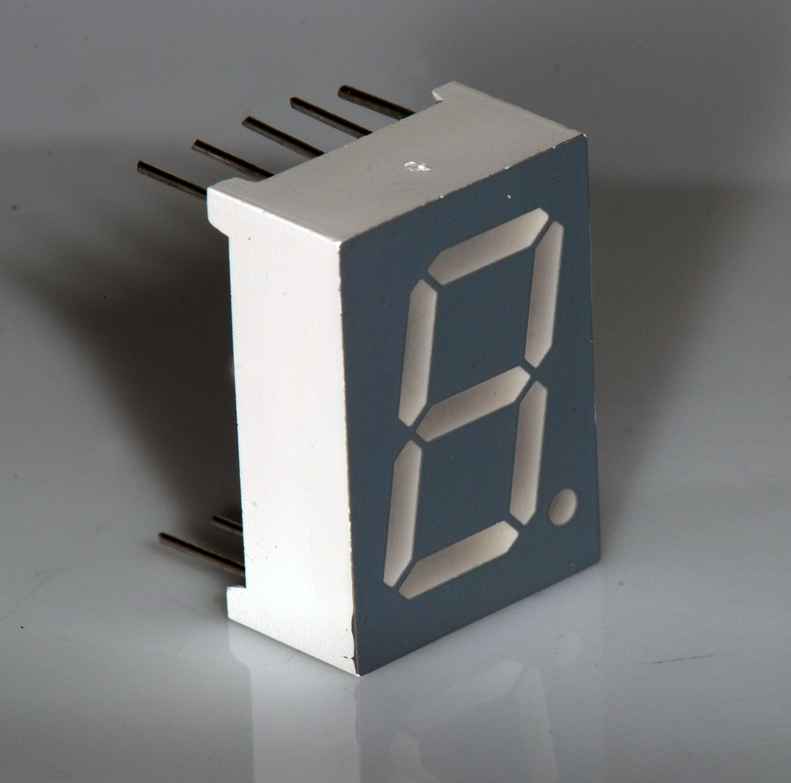
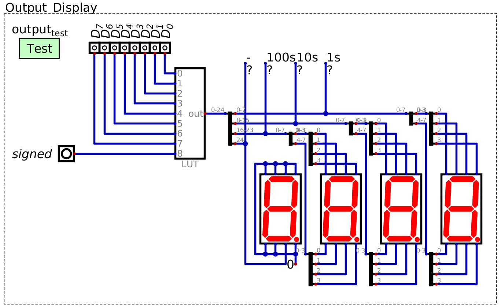
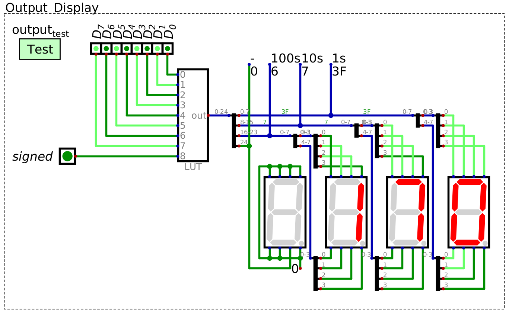
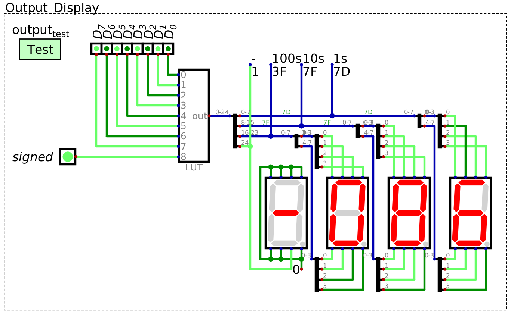

**********************
Seven Segment Displays
**********************

* Binary values from the data bus have been readable through Digital's output components
* However, base 10 is preferable when viewing numbers
* Further, the data on the bus is always changing

    * Sometimes output should persist
    * Not all data on the bus needs to be output

* An output register will be used to improve system outputs
* Seven segment displays will be used as the mechanism for displaying base 10 numbers

    A common seven segment LED display. By turning different segments of the display on/off, different values can be
    visually represented.

Seven Segment Display
=====================

Binary Numbers to Decimal for a Seven Segment Displays
======================================================

Programmable Logic Array
------------------------

Look Up Table
-------------

Using a LUT to Map Numbers to Seven Segment Display Patterns
============================================================

* Since the system is 8 bit, the LUT will be used to decode an 8 bit number into the three digit output

    Look up table for decoding an 8 bit binary number into a pattern for a seven segment display to represent a three
    digit decimal number. This design can display both unsigned and signed (two's complement) binary numbers, depending
    on the state of the "signed" signal. The left most seven segment display is only used to display a negative sign,
    when necessary. This image includes "probes" labelled -, 100s, 10s, and 1s for testing purposes, but are not
    necessary.

* The LUT takes 8 input lines representing an 8 bit number
* Additionally, the LUT will have one additional input line to signify if the number is signed

    * If the number is two's complement

* Thus, the LUT will have a total of 9 input signals

* The LUT would map these input signals to the corresponding seven segment display patterns for the output

    * For example, the number ``0b10101010`` would map to the patterns to display the decimal number 170
    * The number ``0b10101010`` would map to the pattern for -086 if the :math:`signed` signal was high

* Since each digit uses 8 bits to represent, and there are three digits, a total of 24 bits are needed
* However, there is an additional output signal needed to control the negative sign

    * Notice in the design that only one line from the LUT is connected to the left most seven segment display
    * Specifically, the line is connected directly to segment ``g`` of the display, which would be the negative sign

* Thus, there is a total of 25 output bits

* With the design used here

    * The least significant 8 bits of the 25 correspond to the least significant seven segment display
    * The most significant bit controls the negative sign

Creating Seven Segment Display Patterns
---------------------------------------

* A Python script will be used to generate the hex file to be loaded into the LUT
* A series of constants for each bit pattern will be created

    * Notice that these constants are added to a list
    * Within this list, the bit pattern for ``X`` is found in index ``X``

.. literalinclude:: create_seven_segment_patterns_for_look_up_table.py
    :language: python
    :lineno-match:
    :start-after: # [begin-seven_segment_digit_pattern_constants]
    :end-before: # [end-seven_segment_digit_pattern_constants]

* To create the 25 bit output patterns, two bitwise operators will be used

    * Bit shifting

        * Move bits to the left/right in a binary pattern
        * For example, consider shifting a binary pattern 4 bits to the left

            * ``0b0101 << 4`` results in ``0b01010000``

    * Bitwise ``OR``

        * Perform ``OR`` on each bit in two bit patterns
        * For example

            * ``0b11001100 | 0b11110000`` results in ``0b11111100``

* Further, it is possible to obtain the each individual digit in a number

    * Divide the number by the desired digit's *place* value, then mod 10
    * For example, consider the number ``123``

        * ``123 / 100 = 1``, ``1 % 10 = 1`, therefore the 100s place is ``1``
        * ``123 / 10 = 12``, ``12 % 10 = 2`, therefore the 10s place is ``2``
        * ``123 / 1 = 123``, ``123 % 10 = 3`, therefore the 1s place is ``3``

* With this, the idea is to take each 8 bit number, obtain each place's digit's pattern and left shift where necessary
* This is best explained with an example
* Consider the number 123 --- each digits pattern is as follows

    * 1 --- ``00000110``
    * 2 --- ``01011011``
    * 3 --- ``01001111``

* Bit shift the 8 bits for the 100s number 16 bits to the left, shift the 10s 8 bits to the left, and the 1s shift 0
* Each pattern would then be as follows (leading ``0``\s and spaces are included for visual clarity)

    * 1 --- ``00000110 00000000 00000000``
    * 2 --- ``00000000 01011011 00000000``
    * 3 --- ``00000000 00000000 01001111``

* Finally, performing bitwise ``OR`` on these patterns would result in the full pattern for the 8 bit number

    * 123 ---  ``00000110 01011011 01001111``

* Note that the most significant, 25th bit, is not needed here as the number is positive

    * If a bit is not explicitly set to ``1``, it will be ``0``

* Further, in the below code, bit shifting the 1s digit to the left 0 bits has no functional purpose

    * It is included for consistency

.. literalinclude:: create_seven_segment_patterns_for_look_up_table.py
    :language: python
    :lineno-match:
    :start-after: # [begin-unsigned_patterns]
    :end-before: # [end-unsigned_patterns]

* The same idea is used for the signed integers, but following the two's complement pattern

    * ``0b00000000`` -- ``0b011111111`` corresponds to integers 0 -- 127
    * ``0b10000000`` -- ``0b11111111`` correspond to integers -128 -- -1

* For all patterns representing negative numbers, the most significant, 25th bit, is set high

    * To represent the negative sign
    * A single ``1`` would be bit shifted to the left 25

.. literalinclude:: create_seven_segment_patterns_for_look_up_table.py
    :language: python
    :lineno-match:
    :start-after: # [begin-signed_patterns]
    :end-before: # [end-signed_patterns]

* Finally, the lists of patterns are saved to a hex file that can be loaded into the LUT
* The ``v2.0 raw`` is necessary for Digital to parse the hex files
* The first 256 patterns are the unsigned integer patterns
* The following 256 patterns are the signed integers

.. literalinclude:: create_seven_segment_patterns_for_look_up_table.py
    :language: python
    :lineno-match:
    :start-after: # [begin-save_to_file]
    :end-before: # [end-save_to_file]

* Once generated, the hex file can be loaded into the LUT
* Below are examples of using the LUT to decode the signal ``0b10101010`` as an unsigned and signed integer

    LUT decoding the binary pattern ``0b10101010`` to the unsigned decimal number 170``.

    LUT decoding the binary pattern ``0b10101010`` to the signed, two's complement decimal number -86``. The LUT is
    outputting the two's complement pattern since the 9th input bit, which acts as a control signal for signed integers,
    is set to high.

For Next Time
=============

* Something?