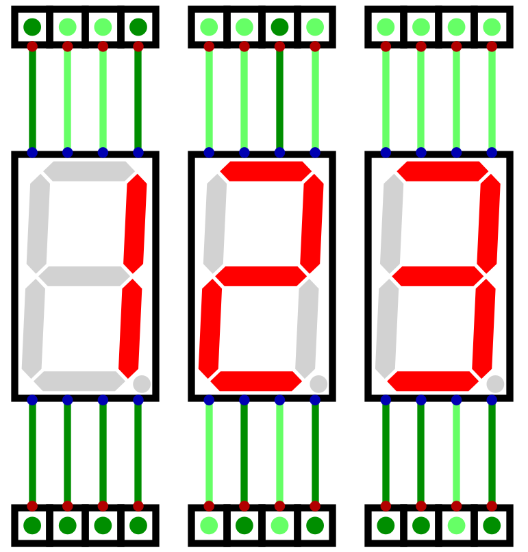
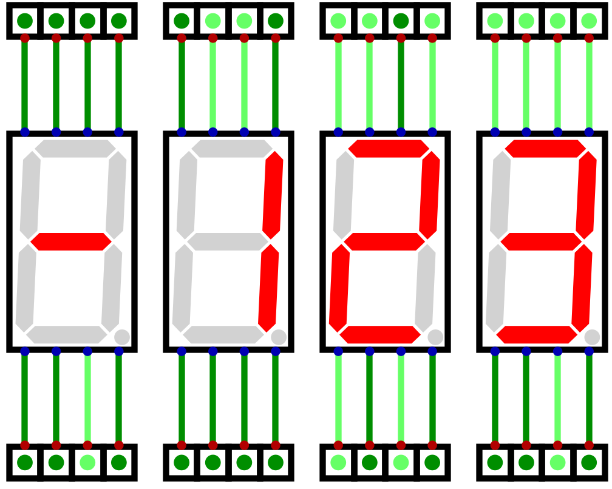

**********************
Seven Segment Displays
**********************

* Binary values from the data bus have been readable through Digital's output components
* However, base 10 is preferable when viewing numbers
* Further, the data on the bus is always changing

    * Sometimes output should persist
    * Not all data on the bus needs to be output

* An output register will be used to improve system outputs
* Seven segment displays will be used as the mechanism for displaying base 10 numbers

.. figure:: real_seven_segment_display.png
    :width: 250 px
    :align: center
    :target: https://en.wikipedia.org/wiki/Seven-segment_display

    A common seven segment LED display. By turning different segments of the display on/off, different values can be
    visually represented.

Seven Segment Display
=====================

Binary Numbers to Decimal for a Seven Segment Displays
======================================================

* A system to convert the binary numbers to their respective seven segment display patterns needs to be developed
* As discussed, a single byte can be used for each seven segment display
* Here, the display's ``a`` input will be the least significant bit, and ``h`` will be the most significant

    * This ordering is a design decision and not a requirement

* Below is a table showing each decimal number's bit pattern for the seven segment display

.. list-table:: Decimal Numbers and Their Seven Segment Display Patterns
    :widths: auto

    * - Decimal
      - Binary
      -
      - Display Pattern
      - Display Hex
      - Output
    * - ``0``
      - ``0b00000000``
      -
      - ``0b00111111``
      - ``0x3F``
      - .. image:: seven_segment_display_0.png
            :width: 50
    * - ``1``
      - ``0b00000001``
      -
      - ``0b00000110``
      - ``0x06``
      - .. image:: seven_segment_display_1.png
            :width: 50
    * - ``2``
      - ``0b00000010``
      -
      - ``0b01011011``
      - ``0x5B``
      - .. image:: seven_segment_display_2.png
            :width: 50
    * - ``3``
      - ``0b00000011``
      -
      - ``0b01001111``
      - ``0x4F``
      - .. image:: seven_segment_display_3.png
            :width: 50
    * - ``4``
      - ``0b00000100``
      -
      - ``0b01100110``
      - ``0x66``
      - .. image:: seven_segment_display_4.png
            :width: 50
    * - ``5``
      - ``0b00000101``
      -
      - ``0b01101101``
      - ``0x6D``
      - .. image:: seven_segment_display_5.png
            :width: 50
    * - ``6``
      - ``0b00000110``
      -
      - ``0b01111101``
      - ``0x7D``
      - .. image:: seven_segment_display_6.png
            :width: 50
    * - ``7``
      - ``0b00000111``
      -
      - ``0b00000111``
      - ``0x07``
      - .. image:: seven_segment_display_7.png
            :width: 50
    * - ``8``
      - ``0b00001000``
      -
      - ``0b01111111``
      - ``0x7F``
      - .. image:: seven_segment_display_8.png
            :width: 50
    * - ``9``
      - ``0b00001001``
      -
      - ``0b01101111``
      - ``0x6F``
      - .. image:: seven_segment_display_9.png
            :width: 50

.. note::

    One may have noticed that the **seven** segment display pattern for the number **seven** is the binary number **seven**.

    This is in no way meaningful, and is a consequence of our bit ordering to the inputs, but an interesting observation
    nonetheless.

* Consider, however, the number 10, which is easily representable in binary with 8 bits
* One cannot represent this number with a single digit

    * Although hex can be used, and an ``A`` can be displayed on a seven segment display, this misses the point
    * The goal is to show decimal numerals
    * Further, the same issue arises with hexadecimal numbers once the number 16 is hit

* The system being designed can represent eight bit numbers, meaning a total of 256 numbers

    * 0 -- 255

* Thus, a total of three digits are required for this system's output

SIMPLE SOLUTION

    Three seven segment displays showing the number 123. The number 123, represented in binary as ``0b01111011`` must
    map to three bytes to display 1, 2, and 3. These bytes would be ``0b00000110``, ``0b01011011``, and ``0b01001111``
    respectively.

negative too, with 2s compleent
but -128 -- 127

, thus, only the ``g`` input would be active.
non negative numbers would display nothing in the left most display

    Four seven segment displays showing the twos complement number -123 (``0b10000101``). The left most display in this
    configuration would only ever be used to show the negative sign, when appropriate.

Programmable Logic Array
------------------------

Look Up Table
-------------

Creating Seven Segment Display Patterns
=======================================

For Next Time
=============

* Something?