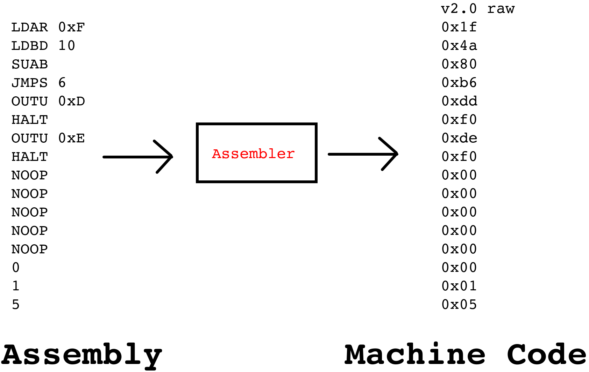

=================
Assembly Language
=================

* With the ability to make decisions, the ESAP system is now complete
* However, using the ESAP system is not particularly easy as it's programmed with machine code

    * Writing programs for the ESAP system is tedious
    * Machine code is prone to errors and and requires memorizing bit patterns

* A solution to this problem is to improve the way programming is done

    * Instead of binary patterns or hex numbers, english mnemonics can be used
    * Other quality of life features can be included, like separating opcode mnemonic from the operand value

* However, the ESAP system ultimately requires machine code

Assembler
=========

* An assembly language is a very low level programming language

    * Often referred to as *assembly*
    * Assembly is strongly tied to a specific system design, the underlying hardware, and its machine language

* An assembler is a tool to convert assembly language to machine code

* When compared to machine code, it enables a more human centric way of programming the system

    * Assembly is effectively programming in machine code, but with a few nice features

* Assembly languages have many benefits over programming in machine code, but two key important features are

    * Mnemonics for referring to specific instructions

        * For example, consider loading the value 5 into register A
        * Instead of the machine code ``0b00100101``, one could write ``LDAD 5``
        * The mnemonic would mean the same thing, and would be translated to the machine code
        * But the mnemonic is much easier to remember and mentally parse

    * Labels/symbolic representation for memory addresses

        * For example, memory addresses could be labelled and referenced by their label
        * This would make referencing memory addresses for jumps and loading from RAM easier
        * Removes the need to remember specific memory addresses
        * Also removes the need to constantly update addresses when lines are added/removed to RAM

* An assembler would take the assembly language and translate it, or *assemble* it, to the corresponding machine code

    * It would replace the mnemonics with their opcode bit patterns and translate literals to their binary/hex values
    * It would replace all labels within the assembly with their corresponding memory addresses

* Typically, each statement in assembly has a 1-to-1 mapping to a statement in machine code
* Despite its simplicity, it improves the programming experience and allows for a small amount of abstraction

    An assembler is a tool used to translate assembly language to machine code. The left hand side shows an example of
    some assembly language making use of mnemonics. The right hand side shows the hex representation of corresponding
    machine code. The assembler takes the assembly language and "assembles" it to the machine code. Here, each
    instruction has a 1-to-1 mapping between assembly and machine code.

The ESAP Assembler
==================

For Next Time
=============

* Something?

