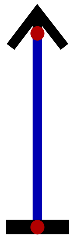

***************************
Electricity and Transistors
***************************

* When talking about electricity and semiconductors, things can get rather nuanced and complex
* However, the level of detail covered for this topic will be kept appropriate for the course content
* As such, certain analogies and ideas will be used that are technically inaccurate, but sufficient for our needs

Electricity
===========

* Electricity is a form of energy that results as a consequence of charged particles moving

* Electrons are negatively charged particles that can move around
* Protons are positively charged particles that don't move around

* Particles with the same charge repel one another

    * For example, electrons repel other electrons

* Particles with different charges attract one another

    * Electrons are attracted to protons

* Substances that are effective at transmitting electric charge are called *conductors*

    * Substances that are not effective at transmitting electric charge are called *insulators*

* Copper, along with several other metals, are good conductors due to how their atoms chemically bond to one another
* As a result of these bonds, the substance has an abundance of *free electrons*
* These electrons can move relatively easily when a charge is applied to it

    Electronic symbol for a single cell battery, a common source of electric charge. One terminal of the battery has a
    positive charge (cathode) and the other terminal has a negative charge (anode).

* Batteries are an example of something that can apply a charge to a conductor
* If a battery is attached to a conductor, its charge will affect the free electrons within the conductor

    * The electrons will be repelled from the negative charge and attracted to the positive charge

.. figure:: charge_from_battery_through_conductor.png
    :width: 333 px
    :align: center
    :target: https://en.wikipedia.org/wiki/Electric_battery

    Battery attached to some conductor. Free electrons within the conductor will be repelled by the negative terminal
    while also being attracted to the positive terminal.

* Batteries are one source of charge; anything with a charge could be used
* Further, charge is always *relative*

* In the context of electronics, it is common to not use a battery symbol, but some arbitrary source of charge

    * Typically, an *up arrow* is used to designate a positive
    * And a *ground* symbol to designate *neutral*

.. figure:: common_ground_symbols.png
    :width: 333 px
    :align: center
    :target: https://en.wikipedia.org/wiki/Ground_(electricity)

    Examples of three commonly used ground symbols. These have slightly different meanings, but all ultimately signify
    something connected to a conductor with a neutral charge.

* Above are three commonly used ground symbols
* But within the context of the circuits being used in this course, a single line is typically used to designate ground

* Below is an example of some positive charge connected directly to ground

    * Here, ground is neutral, but because of the positive charge, ground is relatively negative
    * Thus, electrons will move from ground towards the positive charge

    Example of a positive charge connected directly to ground with some conductor. Here, electrons will move from
    ground, which, although neutral, has a negative charge relative to the positive charge. If a negative charge was
    connected to ground instead, electrons would move towards ground as ground would have a positive charge relative to
    the negative.

.. warning::

    In reality, it is the electrons that physically move; however, for historical reasons, it is common to *pretend*
    that the electricity flows from the positive terminal. This incorrect designation is called *conventional* current.

    When electricity was first discovered, humans had a poor understanding of the underlying mechanics. Benjamine
    Franklin was the original person to assign positive and negative labels and arbitrary decided to say that
    electricity flowed from positive to negative. This convention has, for better or worse, stuck throughout the years.

    This can lead to confusion and frustration, but in the context of this course, this should not be a problem. For
    the remainder of this topic, for the purpose of describing how things work, correct electricity flow will be used.
    After this topic however, conventional flow will be used.

    .. figure:: real_vs_conventional_current_flow.png
        :width: 200 px
        :align: center

        Comparison of actual versus conventional flow. The left image depicts how the electrons would move from ground
        towards the positive charge. The right image shows conventional flow, where electricity flows from the positive
        charge towards the negative.

Voltage, Current, and Resistance
--------------------------------

Semiconductors
==============

Transistors
===========

For Next Time
=============

* Read Chapter 3 Section 3 of your text

    * 5 pages