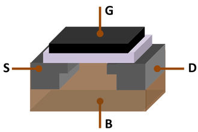
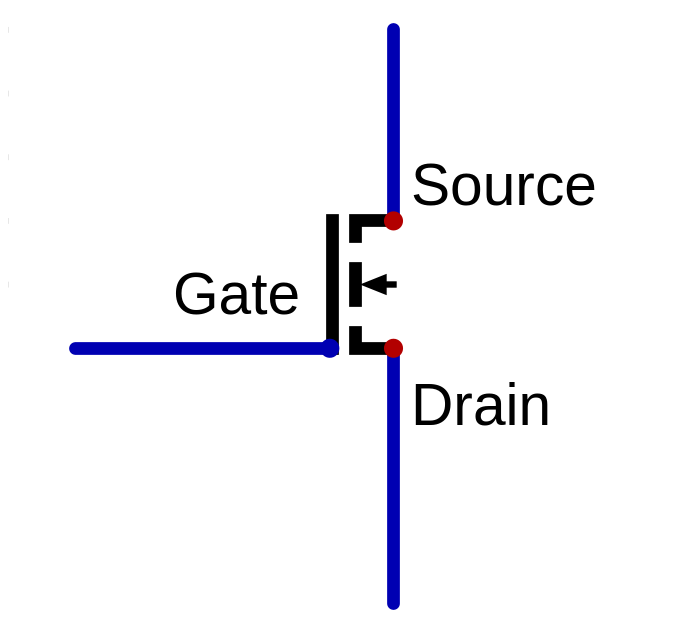
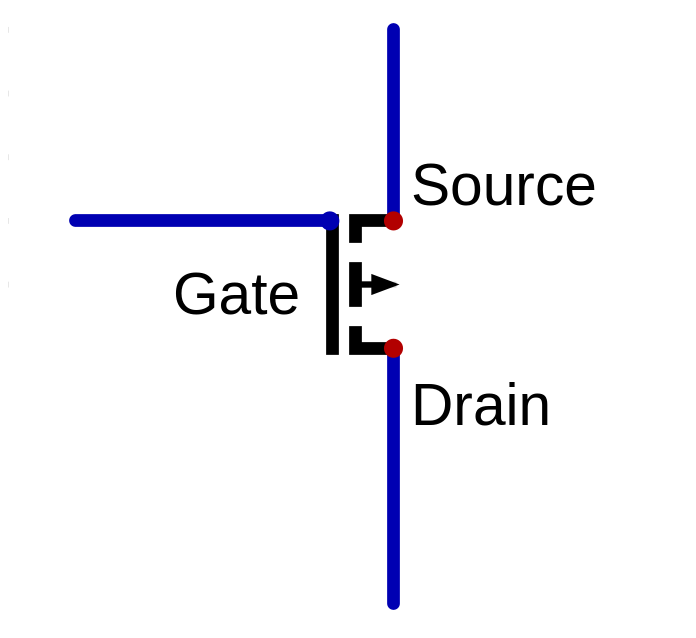
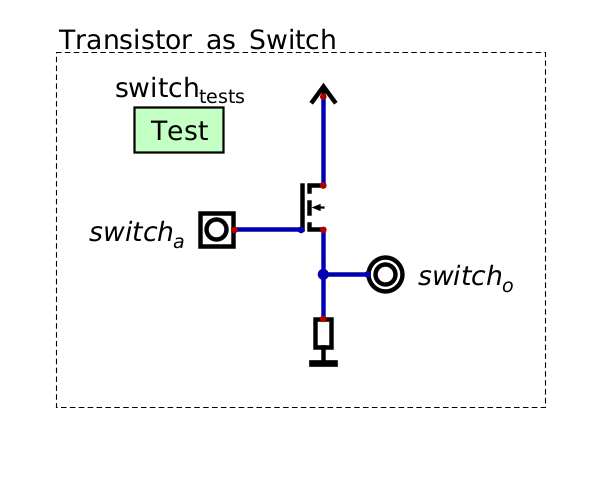
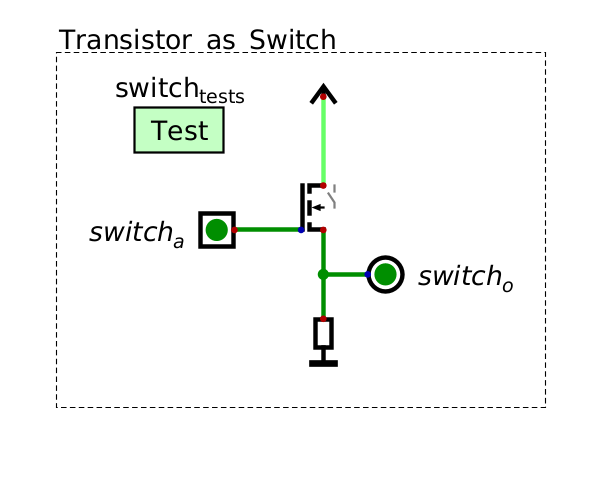
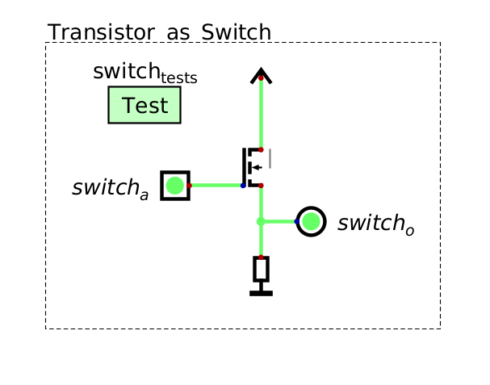

***************************
Transistors and Logic Gates
***************************

* When talking about electricity and semiconductors, things can get rather nuanced and complex
* However, the level of detail covered for this topic will be kept appropriate for the course content
* As such, certain analogies and ideas will be used that are technically inaccurate, but sufficient for our needs

Symbols
=======

Transistors
===========

* Transistors may be one of the most important inventions/discoveries in human history

    *  J. Bardeen, W. Brattain, and W. Shockley got the 1956 Nobel Prize in Physics for creating the first transistor

* Transistors are *semiconductor* devices

    * Not strictly a conductor or insulator
    * Can control the conductive properties of the component

.. note::

    The details on how transistors physically work is outside the scope of this course. For those interested, Ben Eater
    have two videos describing, at a high-level, how they work.

        * `Semiconductors <https://www.youtube.com/watch?v=33vbFFFn04k>`_
        * `Transistors <https://www.youtube.com/watch?v=DXvAlwMAxiA>`_

* Transistors perform simple tasks, but are critically important for our everyday lives
* Typically, transistors are used for signal amplification or as a switches
* For this course, the focus will be on transistor's ability to be used as a switch

* As already discussed, there are several kinds of transistors, but for this course, the focus will be on MOSFET

    Three-dimensional model of a Metal-oxide-semiconductor field-effect transistor (MOSFET). S --- source, D --- drain,
    G --- gate, and B --- body of the transistor. The source, drain, and gate have terminals to connect to a circuit.

.. note::

    Within the context of digital circuits, it is common to refer to signals as ``0``\s and ``1``\s. The use of ``0``
    and ``1`` do not signify a specific voltage, but instead ``0`` means a relatively low voltage and ``1`` means a
    relatively high voltage.

* Below is an image of an N-channel MOSFET
* This transistor can act as a switch for a signal to travel from the source to the drain
* With this type of transistor, the switch is closed (on) when a positive charge is applied to the gate terminal

    * This would allow the signal to travel from the source to the drain
    * The signal at the source is arbitrary

* The switch would be closed (off) is no positive charge is applied to the gate

    N-channel MOSFET as a switch. The switch is "on" when a positive charge is applied to the gate terminal, allowing a
    signal to travel from the source to the drain. If no positive charge is applied to the gate, the switch is "off",
    not allowing a signal to pass through the transistor.

* P-channel MOSFETs exist, which act similar to N-channel, but turn "on" when no positive charge is applied to the gate

    P-channel MOSFET as a switch. The switch is "on" when a negative charge is applied to the gate terminal.

.. note::

    For the most part, N-channel MOSFET transistors will be used in this course.

* Below is a circuit with an N-channel MOSFET acting as a switch on some signal that is always on (``1``)
* There are several components to note

    * N-channel MOSFET
    * Voltage source providing a signal for the source
    * A current limiting resistor and ground connected to the drain
    * A toggleable square button connected to the gate labelled :math:`switch_{a}`

        * Allows for changing the state of the signal applied to the gait when running a simulation
        * These are called *inputs* within Digital

    * A circle to read circuit output labelled :math:`switch_{o}`

        * Allows for easily observing the signal at some point in the circuit
        * These are called *outputs* within Digital

    * A box called "Test" labelled :math:`switch_{tests}`

        * These are where unit tests are written for the circuit
        * These will be discussed in more detail later

    Screenshot of a circuit created in Digital showing an N-channel MOSFET as a switch.

* When no positive charge (a signal of ``0``) is applied to the gate, the transistor does not allow a signal to pass
* The output of this circuit in this state is therefore a signal of ``0``

    Screenshot of a circuit created in Digital showing an N-channel MOSFET as a switch. Here, the switch is off,
    therefore the output of the circuit is ``0``.

* When a positive charge (``1``) is applied to the gate, the transistor allows the signal at the source (``1``) to pass
* Therefore, the output of the circuit in this state is ``1``

    Screenshot of a circuit created in Digital showing an N-channel MOSFET as a switch. Here, the switch is on,
    allowing the ``1`` from the source to pass to the output.

* Although this example may seem silly, remember that the actual signal at the source is arbitrary

    * In the above example, the signal at the source was always set to ``1``

* Further, they become more interesting when combined with additional transistors in clever ways

Logic Gates
===========

For Next Time
=============

* Read Chapter 3 Section 3 of your text

    * 5 pages