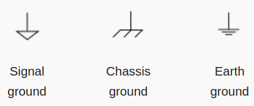

***************************
Transistors and Logic Gates
***************************

* When talking about electricity and semiconductors, things can get rather nuanced and complex
* However, the level of detail covered for this topic will be kept appropriate for the course content
* As such, certain analogies and ideas will be used that are technically inaccurate, but sufficient for our needs

Symbols
=======

* For this course, software called `Digital <https://github.com/hneemann/Digital>`_ will be used to create digital circuits
* There are a number of symbols representing components that will need to be understood
* Although some of you may be familiar with electronic component symbols, there are some things to note

    * Certain components have different symbols depending on their context
    * Some components have different symbols in different regions of the world

* When using Digital

    * An up arrow is used to signify a positive charge
    * A single horizontal line represents ground --- something with no charge; neutral
    * Typically, within the context of computer architecture, the voltage between this positive charge and ground is 5V

.. figure:: vcc_ground.png
    :width: 100 px
    :align: center

    Screenshot from Digital of a positive charge (up arrow) connected directly to ground (horizontal line).

* A single horizontal line is common within computer architecture and is the symbol found in Digital

    * However, there are other common symbols for ground depending on the context of how it is used

    Examples of three commonly used ground symbols. These have slightly different meanings, but all ultimately signify
    something with a neutral charge.

Transistors
===========

Logic Gates
===========

For Next Time
=============

* Read Chapter 3 Section 3 of your text

    * 5 pages